<!--

author:     Gabriele Zöllner, Rebekka Reichert
email:      gabriele.zoellner@hu-berlin.de / rebekka.reichert@hu-berlin.de
date:       2026-09-03
version:    1.0
language:   de
mode:       Textbook
dark:       false

link:       https://cdn.jsdelivr.net/gh/soda-collections-objects-data-literacy/OpenRefine-Beginner-Tutorial@main/theme.css
            https://fonts.googleapis.com/css?family=Noto+Sans

license:    CC BY 4.0 https://creativecommons.org/licenses/by/4.0/ 

icon:       /img/SODa-Logo_Wort-Bild_RGB.png
logo:       /img/SODa-Logo_Wort-Bild_RGB.png

comment:    Dieses Dokument ist eine Open Educational Ressource (OER) zum Thema "Einführung in die Digitale Provenienzforschung". Die OER richtet sich an Einsteiger:innen und Personen ohne Vorkenntnisse, die sich erstmals mit (digitaler) Provenienzforschung beschäftigen.

-->

# Einführung (Digitale) Provenienzforschung
Planen Sie, die Herkunft der Objekte in Ihrer Sammlung zu erforschen? 
Brauchen Sie dafür einen Einstieg in das Feld der (Digitalen) Provenienzforschung –
von methodischen Grundlagen der Provenienzforschung über die Nutzung digitaler Ressourcen und Tools
bis hin zur Erfassung von Provenienzangaben?

Diese Open Educational Resource richtet sich an Einsteiger:innen, wissenschaftliche Mitarbeiter:innen im Sammlungskontext, in Objekt- und Lehrsammlungen arbeitende Personen, Studierende, Promovierende und generell Interessierte, die sich erstmals mit (digitaler) Provenienzforschung beschäftigen. Sie gibt einen grundlegenden Überblick über Begriffe, Entzugskontexte und methodische Ansätze sowie über digitale Recherche- und Dokumentationspraktiken.

Sie ist nicht auf Vollständigkeit ausgelegt, vielmehr geht es darum, einen Überblick und damit weitere Anknüpfungspunkte zur eigenständigen Beschäftigung zu schaffen.

> **Lernziele**
> 
> * Provenienzforschung als Rekonstruktion von Objektbiografien in historischen Kontexten beschreiben
> * zentrale Begriffe wie Provenienzforschung, Kulturgut, Eigentum und Besitz erläutern
> * die Relevanz von Provenienzdokumentation für Sammlungen benennen
> * NS-verfolgungsbedingt entzogenes Kulturgut, koloniale Kontexte und SBZ-/DDR-Kontexte als unterschiedliche Untersuchungsfelder einzuordnen
> * Hinweise auf verschiedene Entzugskontexte erkennen und benennen
> * zentrale interne und externe Recherchequellen der Provenienzforschung unterscheiden
> * digitale Ressourcen, Datenbanken und grundlegende Recherchestrategien für die Provenienzforschung nutzen
> * die Bedeutung strukturierter Provenienzangaben für Veröffentlichung und Nachnutzung erläutern
> * zu erläutern, warum es relevant ist Unsicherheiten, Lücken, Forschungsstände und Quellenangaben in Provenienzangaben kenntlich machen
> * zentrale Qualitätskriterien strukturierter Provenienzangaben benennen
> * Provenienzangaben nach grundlegenden Standards strukturiert erfassen
> * die Relevanz von Metadaten, Normdaten und standardisierten Vokabularen für die digitale Provenienzforschung benennen
> * ereigniszentrierte Erfassung, semantische Modellierung und Graphdatenbanken als weiterführende Konzepte benennen

---

## 1. Grundlagen der Provenienzforschung
Diese Einheit führt in zentrale Begriffe und Fragestellungen der Provenienzforschung ein. Sie gibt einen Überblick über historische Zusammenhänge und unterschiedliche Untersuchungskontexte, darunter NS-verfolgungsbedingt entzogenes Kulturgut, koloniale Kontexte, SBZ/DDR sowie kriegsbedingt verlagertes Kulturgut. Außerdem werden erste rechtlich-ethische Rahmenbedingungen vorgestellt, zum Beispiel die Washingtoner Prinzipien und die Gemeinsame Erklärung.

> **Lernziele**
> 
> * Provenienzforschung als Rekonstruktion von Objektbiografien in historischen Kontexten beschreiben
> * zentrale Begriffe wie Provenienzforschung, Kulturgut, Eigentum und Besitz erläutern
> * die Relevanz von Provenienzforschung und Provenienzdokumentation für Sammlungen einordnen
> * unterschiedliche Untersuchungskontexte wie NS-verfolgungsbedingt entzogenes Kulturgut, koloniale Kontexte und sowjetische Besatzungszone / Deutsche Demokratische Republik benennen
> * grundlegende rechtlich-ethische Rahmenbedingungen der Provenienzforschung, insbesondere die Washingtoner Prinzipien und die Gemeinsame Erklärung, einordnen

### Was ist Provenienzforschung?

!?[Erklärfilm „Was ist Provenienzforschung?“](https://www.youtube.com/watch?v=v7MfOh1T99E "Erklärfilm „Was ist Provenienzforschung?“, CC BY-NC-ND Deutsches Zentrum Kulturgutverluste, bildbad")

Rekonstruktion von Objektbiografien
================

Provenienzforschung rekonstruiert die Biografie von Objekten in ihren historischen Kontexten. Sie fragt danach, wann, wie und unter welchen Umständen Objekte ihren Standort oder ihre Eigentümer:innen gewechselt haben. Dabei geht es nicht nur um das Objekt selbst, sondern auch um seine Funktion, Bedeutung und die historischen, rechtlichen, ethischen und wirtschaftlichen Zusammenhänge, in die es eingebunden war. Provenienzforschung ist daher immer auch Kontextforschung und ein interdisziplinäres Forschungsfeld.

Provenienzforschung im Rahmen der Sorgfaltspflicht und als ethische Sammlungspraxis
================

In der Kunstwissenschaft, im Kunsthandel und bei der Erstellung von Werkverzeichnissen spielt Provenienzforschung seit Langem eine wichtige Rolle. Auch heute ist sie Teil der Sorgfaltspflicht: Die Herkunft eines Objekts muss nachvollziehbar geprüft und dokumentiert werden.

> [!IMPORTANT] ❗ Wichtig
> Die ethischen Richtlinien des International Council of Museums (ICOM) betonen die Verantwortung von Museen im Umgang mit der Herkunft von Objekten. In der aktuellen Version von Juni 2026 wird bereits in der Einleitung deutlich gemacht, dass Museen sich mit ihrer Rolle auseinandersetzen sollen, die sie im Verlauf der Kolonialisierung gespielt haben. Anhand von fünf Kernprinzipien, die jeweils durch Fokusinhalte differenziert werden, werden die ethischen Richtlinien präzisiert ausgeführt. An mehreren Stellen kann man zur Provenienzforschung Bezüge herstellen. Im Teilbereich „COLLECTIONS: Museums research, collect and conserve.“ werden zwei wichtige Teilbereiche betont:
> * C.4: Museen sollten sich an die fachlichen Standards für den Erwerb und die Erfassung von Exponaten halten. 
> * C.10: Museen sollten aktiv auf Rückgabe- und Rückführungsanträge reagieren und, sofern angebracht, eine freiwillige Rückgabe anstreben.
>
> 
ICOM Standing Committee on Ethics. (2026). ICOM Code of Ethics for Museums. https://icom-deutschland.de/wp-content/uploads/2026/06/Code-of-Ethics_2026_EN-1.pdf, Stand: 29.06.2026

 
> [!NOTE] 📝 Zur Vertiefung
> * Deutsches Zentrum Kulturgutverluste, Arbeitskreis Provenienzforschung e.V., Deutscher Bibliotheksverband,  Deutscher Museumsbund, & ICOM Deutschland (Hrsg.). (2019). Leitfaden Provenienzforschung: Zur Identifizierung von Kulturgut, das während der nationalsozialistischen Herrschaft verfolgungsbedingt entzogen wurde, https://kulturgutverluste.de/sites/default/files/2023-04/Leitfaden-Download.pdf 
> * Türnich, R., Heckötter, A., & Offergeld, A. (2019). Projektbericht Provenienzforschung in NRW: Informationen und Empfehlungen für eine systematische, flächendeckende und nachhaltige Provenienzforschung. Landschaftsverband Rheinland
> * Zuschlag, C. (2022). Einführung in die Provenienzforschung: Wie die Herkunft von Kulturgut entschlüsselt wird. C.H. Beck

---

#### Exkurs: Kulturgut

> "Ein Kulturgut ist […] jedes Objekt oder jede Gesamtheit von Objekten von nach heutiger Beurteilung künstlerischem, geschichtlichem, archäologischem, wissenschaftlichem, religiösem oder allgemein kulturellem Wert." 
>
> 
 Handreichung zur Umsetzung der „Erklärung der Bundesregierung, der Länder und der kommunalen Spitzenverbände zur Auffindung und zur Rückgabe NS-verfolgungsbedingt entzogenen Kulturgutes, insbesondere aus jüdischem Besitz“ vom Dezember 1999. Neufassung 2025. S. 21, (2025). https://kulturgutverluste.de/sites/default/files/2026-01/Handreichung.pdf 

 
Zum Kulturgut zählen Gemälde und Skulpturen ebenso wie Archivalien oder Bücher. Auch Gebrauchs- und Alltagsgegenstände können Kulturgut sein, zum Beispiel Mobiliar, Besteck, Automobile, Eisenbahnen oder technisches Gerät. Auch immaterielles Kulturerbe wie mündliche Überlieferungen, überlieferte Bräuche, darstellende Künste oder gesellschaftliche Rituale werden als Kulturgut gezählt. Der Begriff umfasst damit eine große Vielfalt an Objekten und immateriellen Kulturgütern, die jeweils eigene Geschichten sowie unterschiedliche fachliche und disziplinäre Bezüge aufweisen.

> [!NOTE] 📝 Zur Vertiefung
> * Wikipedia, Kulturgut, https://de.wikipedia.org/wiki/Kulturgut

---

#### Exkurs: Eigentum und Besitz
Die Begriffe Eigentum und Besitz werden im Alltag häufig synonym verwendet. Im deutschen Recht bezeichnen sie jedoch zwei unterschiedliche Zustände.

**Eigentum** bedeutet die rechtliche Herrschaft über eine Sache. Eigentümer:innen können grundsätzlich frei über eine Sache verfügen, solange Rechte Dritter nicht verletzt werden. Dazu gehört auch das Recht, eine Sache weiterzuverkaufen. Dieses Recht ist nur dem Eigentümer oder der Eigentümerin vorbehalten.

**Besitz** bedeutet die tatsächliche Herrschaft über eine Sache. Besitzer:innen haben eine Sache also tatsächlich bei sich oder üben unmittelbaren Zugriff darauf aus. Sie dürfen mit der Sache jedoch nur das tun, was ihnen durch Eigentümer:innen oder vertragliche Vereinbarungen erlaubt ist. Ein Recht zum Weiterverkauf besteht nicht. 

| Eigentum                     |      Besitz      |
| --------------------        |-------------|
| rechtliche Herrschaft über eine Sache | tatsächliche Herrschaft über eine Sache | 
| Eigentümer:innen können mit der Sache machen, was sie möchten     | Besitzer:innen können nur das machen, was ihnen die Eigentümer:innen erlaubt haben |
| Recht zum Weiterverkauf | kein Recht zum Weiterverkauf |
| im Gesetz ab [§903 BGB](https://www.gesetze-im-internet.de/bgb/__903.html) | Im Gesetz ab [§854 BGB](https://www.gesetze-im-internet.de/bgb/__854.html) |

Beispiel Leihvertrag
================

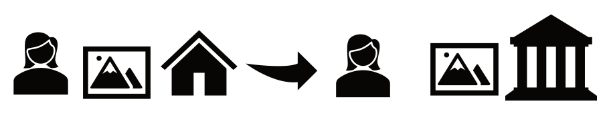

Einer Sammlerin gehört ein Gemälde, das in ihrer Wohnung hängt. 
In diesem Fall ist sie sowohl Eigentümerin, weil sie das Objekt irgendwann irgendwo erworben hat, 
als auch Besitzerin, weil sich das Gemälde in ihrer Wohnung befindet. 

Gibt sie das Gemälde als Leihgabe für eine Ausstellung an ein Museum, bleibt sie Eigentümerin. Das Museum wird jedoch Besitzer des Objekts, sobald sich das Gemälde in den Räumlichkeiten des Museums befindet. Es übt dann die tatsächliche Herrschaft über das Gemälde aus. Der Umgang mit dem Objekt richtet sich nach den Vereinbarungen im Leihvertrag. Das Museum darf also nur das tun, was dort festgelegt wurde.

> [!NOTE] 📝 Zur Vertiefung
> * Koordinierungsstelle für wissenschaftliche Universitätssammlungen in Deutschland (Hrsg.). (2022, Januar 5). *Leitfaden Besitz- und Eigentumsfragen*. https://wissenschaftliche-sammlungen.de/files/9116/4137/9068/HR_Besitz-und-Eigentumsfragen_202201.pdf 
 
---

### Entwicklung der Provenienzforschung

Provenienzforschung ist kein neues Arbeitsfeld. In Museen, (Universitäts-)Sammlungen, Bibliotheken, Archiven, im Kunsthandel und in der Kunstwissenschaft spielte die Frage nach der Herkunft von Objekten schon lange eine Rolle. Häufig wurde sie jedoch eher als unterstützende Tätigkeit verstanden: Sie half dabei, Objektgeschichten zu ergänzen, Besitzverhältnisse zu klären, die Authentizität eines Objektes oder Angaben in Werkverzeichnissen und Sammlungskatalogen zu überprüfen. 

Seit den 1990er Jahren hat sich die Bedeutung der Provenienzforschung deutlich verändert. Sie wurde zunehmend zu einem eigenständigen Forschungsfeld, das eng mit rechtlichen, ethischen und gesellschaftspolitischen Fragen verbunden ist. Im Mittelpunkt steht nicht nur die Frage, woher ein Objekt kommt, sondern auch, unter welchen historischen Bedingungen es seinen Standort, seine Besitzer:innen oder Eigentümer:innen gewechselt hat.

Ein wichtiger Wendepunkt in dieser Entwicklung zeigt sich an der Auseinandersetzung mit NS-verfolgungsbedingt entzogenem Kulturgut. Einen wichtigen Ausgangspunkt dafür bildeten die Washington Principles von 1998 und die Gemeinsame Erklärung von 1999.

#### Washington Principles und Gemeinsame Erklärung
Im Dezember 1998 kamen Vertreter von 43 Staaten sowie 13 nichtstaatlichen Organisationen auf der **Washington Conference on Holocaust-Era Assets** zusammen. Dort wurden die sogenannten Washington Principles verabschiedet. Sie formulieren Grundsätze für den Umgang mit Kunstwerken, die während des Nationalsozialismus beschlagnahmt und in der Folge nicht zurückgegeben wurden.

Ziel der Washington Principles ist es, NS-verfolgungsbedingt entzogene Kunstwerke zu identifizieren, die Forschung durch zugängliche Unterlagen und Archive zu unterstützen und gemeinsam mit den früheren Eigentümer:innen oder ihren Erb:innen gerechte und faire Lösungen zu finden. Dabei wird ausdrücklich berücksichtigt, dass Provenienzforschung aufgrund der verstrichenen Zeit und der besonderen Umstände des Holocaust häufig mit Lücken, Unsicherheiten und unvollständigen Quellen arbeiten muss.

> **Washingtoner Prinzipien 1998**
>
> 1. Kunstwerke, die von den Nationalsozialisten beschlagnahmt und in der Folge nicht zurückerstattet wurden, sollten identifiziert werden.
> 2. Einschlägige Unterlagen und Archive sollten der Forschung gemäß den Richtlinien des International Council on Archives zugänglich gemacht werden.
> 3. Es sollten Mittel und Personal zur Verfügung gestellt werden, um die Identifizierung aller Kunstwerke, die von den Nationalsozialisten beschlagnahmt und in der Folge nicht zurückerstattet wurden, zu erleichtern.
> 4. Bei dem Nachweis, dass ein Kunstwerk durch die Nationalsozialisten beschlagnahmt und in der Folge nicht zurückerstattet wurde, sollte berücksichtigt werden, dass aufgrund der verstrichenen Zeit und der besonderen Umstände des Holocaust Lücken und Unklarheiten in der Frage der Herkunft unvermeidlich sind.
> 5. Es sollten alle Anstrengungen unternommen werden, Kunstwerke, die als durch die Nationalsozialisten beschlagnahmt und in der Folge nicht zurückerstattet identifiziert wurden, zu veröffentlichen, um so die Vorkriegseigentümer oder ihre Erben ausfindig zu machen.
> 6. Es sollten Anstrengungen zur Einrichtung eines zentralen Registers aller diesbezüglichen Informationen unternommen werden.
> 7. Die Vorkriegseigentümer und ihre Erben sollten ermutigt werden, ihre Ansprüche auf Kunstwerke, die durch die Nationalsozialisten beschlagnahmt und in der Folge nicht zurückgegeben wurden, anzumelden.
> 8. Wenn die Vorkriegseigentümer von Kunstwerken, die durch die Nationalsozialisten beschlagnahmt und in der Folge nicht zurückgegeben wurden, oder ihre Erben ausfindig gemacht werden können, sollten rasch die nötigen Schritte unternommen werden, um eine gerechte und faire Lösung zu finden, wobei diese je nach den Gegebenheiten und Umständen des spezifischen Falls unterschiedlich ausfallen kann.
> 9. Wenn bei Kunstwerken, die nachweislich von den Nationalsozialisten beschlagnahmt und in der Folge nicht zurückgegeben wurden, die Vorkriegseigentümer oder deren Erben nicht ausfindig gemacht werden können, sollten rasch die nötigen Schritte unternommen werden, um eine gerechte und faire Lösung zu finden.
> 10. Kommissionen oder andere Gremien, welche die Identifizierung der durch die Nationalsozialisten beschlagnahmten Kunstwerke vornehmen und zur Klärung strittiger Eigentumsfragen beitragen, sollten eine ausgeglichene Zusammensetzung haben.
> 11. Die Staaten werden dazu aufgerufen, innerstaatliche Verfahren zur Umsetzung dieser Richtlinien zu entwickeln. Dies betrifft insbesondere die Einrichtung alternativer Mechanismen zur Klärung strittiger Eigentumsfragen. 
>
>  
Deutsches Zentrum Kulturgutverluste (Hrsg.). (1998, Dezember 3). Washingtoner Prinzipien. https://kulturgutverluste.de/sites/default/files/2023-04/Washingtoner-Prinzipien.pdf 

In Deutschland wurden diese Grundsätze 1999 durch die Bundesregierung, die Länder und die kommunalen Spitzenverbände mit der sogenannten **Gemeinsamen Erklärung** anerkannt. Träger öffentlicher Einrichtungen sind damit verpflichtet, darauf hinzuwirken, NS-verfolgungsbedingt entzogene Kulturgüter aufzufinden und an die rechtmäßigen Eigentümer:innen oder deren Erb:innen zurückzugeben beziehungsweise gerechte und faire Lösungen zu finden.

Die Gemeinsame Erklärung ist keine gesetzliche Regelung, sondern eine Selbstverpflichtung. Sie besitzt daher keine unmittelbare rechtliche Bindung, hat aber eine hohe moralische und politische Verbindlichkeit. Seitdem gab es weitere Revisionen und Ergänzungen, zuletzt im Jahr 2025.

**Beispiele für gerechte und faire Lösungen**
* Das Objekt wird an die Eigentümer:innen oder deren Erb:innen zurückgegeben.
* Die Kultureinrichtung erwirbt das Objekt nach einer Einigung zurück.
* Das Objekt wird der Kultureinrichtung von den Eigentümer:innen oder deren Erb:innen geschenkt.
* Das Objekt wird restituiert und anschließend als Leihgabe für Ausstellungen zur Verfügung gestellt.

> [!NOTE] 📝 Zur Vertiefung
> * Der Beauftragte der Bundesregierung für Kultur und Medien. (2025). Handreichung zur Umsetzung der „Erklärung der Bundesregierung, der Länder und der kommunalen Spitzenverbände zur Auffindung und zur Rückgabe NS-verfolgungsbedingt entzogenen Kulturgutes, insbesondere aus jüdi schem Besitz“ vom Dezember 1999. Neufassung 2025. https://kulturgutverluste.de/sites/default/files/2026-01/Handreichung.pdf
> * Deutsches Zentrum Kulturgutverluste (Hrsg.). (1999, Juni 4). Gemeinsame Erklärung. https://kulturgutverluste.de/sites/default/files/2023-04/Gemeinsame-Erklaerung.pdf
> * Erklärfilm: Was sind gerechte und faire Lösungen? https://youtu.be/9F2WYn2EpMo?si=MZScvc23DUIpn5GT © Deutsches Zentrum Kulturgutverluste, bildbad, Stand: 11.06.2026

---

#### Koloniale Kontexte

Seit den 2000er Jahren rückten neben der NS-Provenienzforschung zunehmend auch koloniale Kontexte in den Vordergrund. Der Begriff bezeichnet die Umstände, Prozesse und Folgen des Kolonialismus seit der europäischen Expansion im 15. Jahrhundert.

Gemeint sind nicht nur formale Kolonialherrschaften, sondern auch koloniale Machtverhältnisse, Strukturen und Denkmuster, die bis heute nachwirken können. Dazu gehören etwa Ausbeutungsverhältnisse, die Marginalisierung bestimmter Bevölkerungsgruppen oder Vorstellungen einer vermeintlichen kulturellen Höherwertigkeit.

Debatten und politische Reaktionen
================

 via Wikimedia Commons")

Zur verstärkten öffentlichen Auseinandersetzung mit kolonialen Kontexten trugen unter anderem die
[Debatte um das Humboldt-Forum in Berlin](https://www.kulturrat.de/thema/erinnerungskultur/humboldt-forum/) sowie internationale Restitutionsdebatten bei. Einen wichtigen Impuls setzte 2017 die Rede des französischen Präsidenten Emmanuel Macron in Ouagadougou, auf die 2018 der [Bericht von Felwine Sarr und Bénédicte Savoy](https://de.wikipedia.org/wiki/Bericht_über_die_Restitution_afrikanischer_Kulturgüter) zur Rückgabe afrikanischen Kulturerbes aus französischen Sammlungen folgte. 
In Deutschland wurden koloniale Kontexte seit 2018 auch politisch stärker aufgegriffen.

Wichtige Bezugspunkte sind: 
* Aufarbeitung der Provenienzen von Kulturgut aus kolonialem Erbe (ab 2018) nach [Bekenntnis der deutschen Regierungskoalition 2018-2021](https://archiv.cdu.de/system/tdf/media/dokumente/koalitionsvertrag_2018.pdf?file=1)
* [„Erste Eckpunkte zum Umgang mit Sammlungsgut aus kolonialen Kontexten“](https://www.kmk.org/fileadmin/pdf/PresseUndAktuelles/2019/2019-03-25_Erste-Eckpunkte-Sammlungsgut-koloniale-Kontexte_final.pdf) (2019)
* Etablierung u. a. von
  * [Kontaktstelle](https://www.germancontactpoint.de/)
  * [CCC-Portal](https://ccc.deutsche-digitale-bibliothek.de/de/)

* [„Gemeinsame Leitlinien zum Umgang mit Kulturgütern und menschlichen Überresten aus kolonialen Kontexten“](https://www.cp3c.de/grundlagendokumente/251014_Gemeinsame_Leitlinien_zum_Umgang_mit_Kulturguetern_und_menschlichen_Ueberresten_aus_kolonialen_Kontexten.pdf) (2025)

Exkurs: Sensible Objekte
===

Nicht nur im Zusammenhang mit kolonialen Kontexten, aber sehr häufig, stößt man auf **sensible Objekte**, deren Umgang besondere Aufmerksamkeit erfordert. Sarah Fründt beschreibt dies folgendermaßen: 

> "Sensibel meint […], dass der Umgang mit diesen Objekten vielleicht etwas problematischer oder anspruchsvoller ist als der mit anderen Objekten – in der Hauptsache deswegen, weil es Menschen außerhalb der Sammlungen gibt, die davon betroffen sein könnten."
> 
> 
Fründt, S. (2015, August 9). S wie Sensible Sammlungen [Blog]. Museum und Verantwortung. https://sensmus.hypotheses.org/117 

Die Sensibilität eines Objekts ergibt sich also nicht allein aus seiner Beschaffenheit oder seinem Alter. Häufig hängt sie mit seiner Geschichte zusammen: Viele sensible Objekte gehörten ursprünglich Personen, Gesellschaften oder Gemeinschaften außerhalb der aufbewahrenden Sammlung und gelangten möglicherweise nicht im Einvernehmen dorthin.

Sensible Objekte lassen sich in verschiedene Kategorien einteilen:

Historisch sensibles Sammlungsgut

Als historisch sensibles Sammlungsgut gelten Objekte, deren Herstellung, Erwerb oder Sammlung mit problematischen historischen Kontexten verbunden ist. Beispiele hierfür sind Kolonialismus, Nationalsozialismus oder Bürgerkriegssituationen. Entscheidend ist, dass die Objektgeschichte durch Gewalt, Zwang oder ausgeprägte Abhängigkeitsverhältnisse geprägt war oder ist. 

> „Die Umstände, unter denen Sammlungsgut gesammelt, erworben oder hergestellt wurde/wird können bedeuten, dass es mit  besonderer Sensibilität behandelt werden muss. […] Die Erwerbung war oftmals mit Ausübung von Gewalt und/oder ausgeprägten Abhängigkeitsverhältnissen verbunden." 
>
> 
Ahrndt, W., & Deutscher Museumsbund e.V. (Hrsg.). (2021). Leitfaden zum Umgang mit Sammlungsgut aus kolonialen Kontexten (3. Aufl.). Deutscher Museumsbund e.V, S. 19-20, https://www.museumsbund.de/publikationen/leitfaden-zum-umgang-mit-sammlungsgut-aus-kolonialen-kontexten/ 

Kulturell sensibles Sammlungsgut

Kulturell sensibles Sammlungsgut umfasst zum Beispiel menschliche Überreste und zugehörige Grabbeigaben, religiöse oder zeremonielle Objekte sowie Herrschaftszeichen.

> „Ihnen [kulturell sensiblen Objekte] kommt meist eine besondere Bedeutung zu, weshalb der Umgang mit ihnen in der Herkunftsgesellschaft begründeten Zu- und Umgangsbeschränkungen unterliegen kann.“
>
> 
Ahrndt, W., & Deutscher Museumsbund e.V. (Hrsg.). (2021). Leitfaden zum Umgang mit Sammlungsgut aus kolonialen Kontexten (3. Aufl.). Deutscher Museumsbund e.V, S. 20, https://www.museumsbund.de/publikationen/leitfaden-zum-umgang-mit-sammlungsgut-aus-kolonialen-kontexten/ 

Für solche Objekte können in den Gesellschaften und Gemeinschaften, aus denen die Objekte stammen, bestimmte Zugangs- und Umgangsbeschränkungen gelten. Manche Objekte dürfen beispielsweise nur von bestimmten Personen betrachtet, berührt oder genutzt werden. Deshalb erfordert der Umgang mit ihnen besondere Sensibilität und eine Auseinandersetzung mit den Perspektiven der betroffenen Gemeinschaften.

Abbildung Verstorbener

Auch Abbildungen und Aufzeichnungen verstorbener Personen können sensibel sein. Das betrifft zum Beispiel Fotografien, Zeichnungen, Abformungen, anthropometrische Daten sowie Film- und Tonaufnahmen von Angehörigen der Herkunftsgesellschaften.

> "Derartige Aufzeichnungen standen und stehen zum Teil heute noch in starkem Gegensatz zum Weltbild und dem Werteverständnis der betroffenen Herkunftsgesellschaften. Zudem entstanden viele dieser Materialien im kolonialen Kontext unter Zwang oder Gewalt."
> 
> 
 Ahrndt, W., & Deutscher Museumsbund e.V. (Hrsg.). (2021). Leitfaden zum Umgang mit Sammlungsgut aus kolonialen Kontexten (3. Aufl.). Deutscher Museumsbund e.V, S. 21, https://www.museumsbund.de/publikationen/leitfaden-zum-umgang-mit-sammlungsgut-aus-kolonialen-kontexten/ 

Viele dieser Materialien entstanden im kolonialen Kontext unter Bedingungen von Zwang, Gewalt oder entwürdigender Behandlung. Sie wurden zum Teil auch zur Stützung rassistischer und kolonialer Ideologien genutzt. Der Zugang zu solchen Materialien und ihre Nutzung sollten daher besonders sorgfältig geprüft werden.  

> [!NOTE] 📝 Zur Vertiefung
> * Ahrndt, W., & Deutscher Museumsbund e.V. (Hrsg.). (2021). Leitfaden zum Umgang mit Sammlungsgut aus kolonialen Kontexten (3. Aufl.). Deutscher Museumsbund e.V. https://www.museumsbund.de/publikationen/leitfaden-zum-umgang-mit-sammlungsgut-aus-kolonialen-kontexten/
> * Deutsches Zentrum Kulturgutverluste: https://kulturgutverluste.de/kontexte/koloniale-kontexte

---

#### SBZ/DDR

Nach dem Zweiten Weltkrieg kam es auch in der Sowjetischen Besatzungszone (SBZ) und der Deutschen Demokratischen Republik (DDR) zu Kulturgutentziehungen. Gemeint sind Entziehungs- und Verlagerungskontexte zwischen 1945 und 1990. Sie bilden neben NS-verfolgungsbedingt entzogenem Kulturgut und kolonialen Kontexten ein weiteres zentrales Untersuchungsfeld der Provenienzforschung in Deutschland.

Die rechtlichen und ethischen Rahmenbedingungen unterscheiden sich je nach Entzugskontext. Für koloniale Kontexte gibt es bislang keinen einheitlichen rechtlich bindenden Restitutionsrahmen. Für NS-verfolgungsbedingt entzogenes Kulturgut bilden die Washington Principles eine international anerkannte ethische Grundlage. Für Entziehungen in der SBZ und DDR besteht hingegen ein vergleichsweise präziser gesetzlicher Rahmen.
 
Für Verlagerungs- und Entzugskontexte in der SBZ ist insbesondere das „Gesetz über die Entschädigung nach dem Gesetz zur Regelung offener Vermögensfragen und über staatliche Ausgleichsleistungen für Enteignungen auf besatzungsrechtlicher oder besatzungshoheitlicher Grundlage“, kurz „EALG“ vom 27. September 1994 relevant, das zuletzt 2005 aktualisiert wurde. Für Vermögensentziehungen aus der Zeit der DDR greift das Gesetz zur Regelung offener Vermögensfragen vom 23. September 1990, kurz das „VermG“, das zuletzt 2021 geändert wurde.

> [!IMPORTANT] ❗ Wichtig
> * [**EALG:**](https://www.gesetze-im-internet.de/ealg/BJNR262400994.html) Gesetz über die Entschädigung nach dem Gesetz zur Regelung offener Vermögensfragen und über staatliche Ausgleichsleistungen für Enteignungen auf besatzungsrechtlicher oder besatzungshoheitlicher Grundlage, 27.09.1994 (Bundesgesetzblatt I, S. 2624)
> * [**VermG:**](https://www.gesetze-im-internet.de/vermg/) Gesetz zur Regelung offener Vermögensfragen, 23.09.1990 

Obwohl es für diesen Bereich gesetzliche Regelungen gibt, blieb der Forschungsstand lange lückenhaft. Erst seit den 2010er Jahren wurde die Provenienzforschung zu Kulturgutentziehungen in SBZ und DDR stärker politisch und institutionell verankert. 2015 richtete das Deutsche Zentrum Kulturgutverluste eine Fördergrundlage zur Erforschung von Kulturgutentziehungen in SBZ und DDR ein. Auch in aktuellen politischen Programmen wird dieses Forschungsfeld weiterhin ausdrücklich benannt:

* Oktober 2013 bis Oktober 2017: [Koalitionsvertrag](https://www.bundestag.de/resource/blob/194886/696f36f795961df200fb27fb6803d83e/koalitionsvertrag-data.pdf) von CDU, CSU und SPD der 18. Legislaturperiode, S. 131
* Januar 2015 bis Januar 2016: Entwicklung einer Fördergrundlage zur Erforschung von Kulturgutentziehungen in SBZ und DDR
* seit März 2025: [Koalitionsvertrag](https://www.koalitionsvertrag2025.de/sites/www.koalitionsvertrag2025.de/files/koav_2025.pdf) von CDU, CSU und SPD der 21. Legislaturperiode, S. 121

> [!NOTE] 📝 Zur Vertiefung
> Deutsches Zentrum Kulturgutverluste: https://kulturgutverluste.de/kontexte/sbz-ddr

---

### Was ist Digitale Provenienzforschung?

Digitale Provenienzforschung ist Teil der „traditionellen“ Provenienzforschung. Sie erweitert provenienzbezogene Fragestellungen um datenbezogene Perspektiven, Methoden und Werkzeuge.

Objektdaten = Forschungsdaten
================
Digitale Provenienzforschung begreift Objektdaten als Forschungsdaten. Dazu gehören sowohl Quellen und Materialien als auch Forschungsergebnisse, die im Rahmen einer Forschungsfrage gesammelt, erzeugt, beschrieben oder ausgewertet werden. Wenn diese Daten maschinenlesbar aufbereitet werden, können sie langfristig archiviert, zitiert, weiterverarbeitet und mit anderen Datenbeständen verknüpft werden.

Damit berührt Digitale Provenienzforschung auch Fragen des Forschungsdatenmanagements: Wie werden Daten so beschrieben, gesichert und bereitgestellt, dass sie nachvollziehbar bleiben und von anderen nachgenutzt werden können?

Beispiel: Digitale Erfassung

Ein Beispiel für digitale Provenienzforschung ist das KUPFER-Projekt der Fakultät für Gestaltung an der Hochschule Pforzheim. Ziel des Projektes ist eine medien- und designhistorische Erforschung der historischen Lehrmittelsammlung. Diese Sammlung spiegelt rund 150 Jahre Designausbildung wider. 

In einem Pilotprojekt wurden historische Inventarkarten zu Objekten der Lehrmittelsammlung digitalisiert und mithilfe eines Python-Skripts automatisiert ausgelesen. Anschließend wurden die Informationen der Inventarkarten auf das Datenbanksystem museum-digital gemappt, um die Daten dort einpflegen zu können. Dabei spielten auch Angaben zur Erwerbung der Objekte eine wichtige Rolle, da diese ebenfalls erfasst, zugeordnet und ergänzt werden mussten.

 . Inventarkarten zur Erschließung der Lehrmittelsammlung der Kunstgewerbeschule Pforzheim. Ein Pilotprojekt mit Scans, Python und museum-digital. Zenodo. https://doi.org/10.5281/zenodo.16269275 Stand: 17.03.2026")

> [!NOTE] 📝 Zur Vertiefung
> * Schmid, T., & Wittemann, K. (2025, Juli 16). Inventarkarten zur Erschließung der Lehrmittelsammlung der Kunstgewerbeschule Pforzheim. Ein Pilotprojekt mit Scans, Python und museum-digital. Zenodo. https://doi.org/10.5281/zenodo.16269275

Data Science und datenbasierte Forschung
================
Digitale Provenienzforschung erfordert als interdisziplinäres Feld u.a. Methoden der Data Science. Dazu gehören die digitale Analyse und Visualisierung größerer Datenbestände, um Zusammenhänge sichtbar zu machen und neue Forschungsfragen zu entwickeln. Voraussetzung dafür ist, dass Provenienzdaten zunächst strukturiert erfasst, gepflegt, nachvollziehbar dokumentiert und möglichst standardisiert bereitgestellt werden.

Für die Provenienzforschung können solche Ansätze zum Beispiel relevant werden, wenn größere Datenbestände ausgewertet, Personennetzwerke rekonstruiert, Objektbewegungen visualisiert oder Muster in Erwerbungs- und Sammlungsgeschichten untersucht werden. 

Beispiel: Personennetzwerke und Objektbewegungen bei Wikidata

Ein Beispiel ist die Arbeit der Forscherin Laurel Zuckerman. Sie nutzt Wikidata, um Personennetzwerke und Objektbewegungen im Kontext des NS-Kunstraubs sichtbar zu machen und Muster zu identifizieren. Mithilfe der graphenbasierten Programmiersprache SPARQL können dabei Daten aus unterschiedlichen Quellen zusammengeführt, visualisiert und ausgewertet werden.

. Tracking Looted Art with Graphs: a Wikidata Case Study. Graphs and Networks in the Humanities 2022: Technologies, Models, Analyses, and Visualizations, 6th International Conference. Amsterdam, 2022. https://www.academia.edu/video/l4aX5k?email_video_card=title&pls=FAAVP, [11:11 min.].")

> [!NOTE] 📝 Zur Vertiefung
> * SPARQL.dev. (2026). The Comprehensive Guide to SPARQL in 2026. SPARQL.Dev. Abgerufen 19. August 2026, von https://sparql.dev/
> * Zuckerman, L. (2022). Tracking Looted Art with Graphs: a Wikidata Case Study. Graphs and Networks in the Humanities 2022: Technologies, Models, Analyses, and Visualizations, 6th International Conference. Amsterdam, 2022. https://www.academia.edu/video/l4aX5k?email_video_card=title&pls=FAAVP Stand: 11.06.2026

Beispiel: Provenienz-Explorer zur Erkundung bibliothekarischer Provenienzmerkmale

Ein weiteres Beispiel stellt der Provenienz-Explorer von Roman Kuhn dar. Der Provenienz-Explorer ermöglicht es, die Suchergebnisse zu bibliothekarischen Provenienzmerkmalen im Verbundkatalog K10plus zu bündeln, auszuwerten und zu visualisieren. Eine App-Ansicht erlaubt es, einige Grundfunktionen und -auswertungen auszuführen. Provenienzforscher:innen, die tiefer einsteigen wollen, können den Python-Code des Notebooks individuell anpassen.

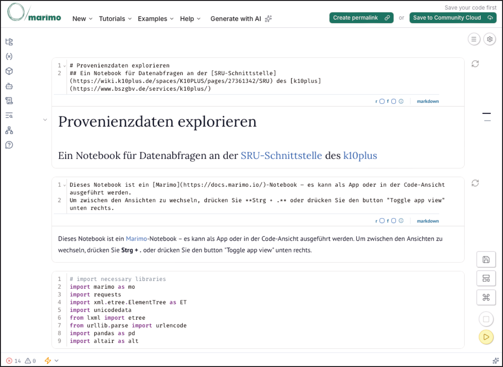

> [!NOTE] 📝 Zur Vertiefung
> * Provenienz-Explorer beim Stabi Lab: https://lab.sbb.berlin/provenienz-explorer/
> * Provenienz-Explorer bei GitHub: https://github.com/StabiBerlin/Provenienz_SRU 
> * Präsentation: Kuhn, R. (2026, June 10). Von MARC 361 zur Datenanalyse: Digitale Exploration bibliothekarischer Provenienzen im K10plus-Verbundkatalog. Zenodo. https://doi.org/10.5281/zenodo.20627467 

Definition Digitale Provenienzforschung bei SODa
================
Für SODa, wo es unter anderem um die Vermittlung von Datenkompetenzen geht, hat die Fachexpertise Digitale Provenienzforschung folgende Arbeitsdefinition erstellt:
> Digitale Provenienzforschung ist eine Forschungspraxis mit Datenkompetenzen – also mit der **Fähigkeit**, Daten auf **kritische Art und Weise zu sammeln, zu verwalten, zu bewerten und zu analysieren**. 

> [!NOTE] 📝 Zur Vertiefung
> * Hopp, M. (2022, Juli 6). Digitale Provenienzforschung. Methoden und Herausforderungen. Offenes Forschungskolloquium Digital History, Berlin. https://doi.org/10.58079/nl3t
> * Lang, S. (2023, August 7). Wie hat sich Provenienzforschung durch Digitalität verändert? RETOUR. https://doi.org/10.58079/tohp
> * Ridsdale, C., Rothwell, J., Smit, M., Bliemel, M., Irvine, D., Kelley, D., Matwin, S., Wuetherick, B., & Ali-Hassan, H. (2015). Strategies and Best Practices for Data Literacy Education Knowledge Synthesis Report. https://doi.org/10.13140/RG.2.1.1922.5044
> * Leyrer, K., Reichert, R., & Zöllner, G. (2025, Februar 5). Auf ein Soda mit der Fachexpertise Digitale Provenienzforschung. Dinge & Daten. https://sammlungen.io/blog/auf-ein-soda-mit-der-fachexpertise-digitale-provenienzforschung

---

### Themenbereich 1: Übungen

Auf dieser Seite können Sie Ihr Wissen prüfen und vorbereitend auf die folgenden Themenbereiche einige Fragen reflektieren.

Fragebogen
===

                            {{1}}

                          --{{2}}--
Was kann als Kulturgut gezählt werden?

(Multiple-Choice)

- [[x]] Gemälde und Skulpturen
- [[X]] Archivalien und Bücher
- [[X]] Alltagsgegenstände
- [[x]] Bräuche und Rituale
                            {{2}}

                          --{{3}}--

Besitz oder Eigentum - was trifft zu?

    [[Besitzer:in]   (Eigentümer:in)]
    [    [ ]           [X]      ]  hat die rechtliche Herrschaft über eine Sache.
    [    (X)           ( )      ]  hat die tatsächliche Herrschaft über eine Sache.
    [    [ ]           [X]      ]  kann mit der Sache machen, was er/sie möchte.
    [    (X)           ( )      ]  hat kein Recht zum Weiterverkauf einer Sache.

    {{3}}

                            --{{4}}--
Wie können gerechte und faire Lösungen aussehen? 

(Multiple-Choice)

- [[x]] Das Objekt wird an die Eigentümer:innen oder deren Erb:innen zurückgegeben.
- [[X]] Die Kultureinrichtung erwirbt das Objekt nach einer Einigung zurück.
- [[X]] Das Objekt wird der Kultureinrichtung von den Eigentümer:innen oder deren Erb:innen geschenkt.
- [[x]] Das Objekt wird restituiert und anschließend als Leihgabe für Ausstellungen zur Verfügung gestellt.

                            {{4}}

                            --{{5}}--

Welche Aussagen treffen zu? 

(Multiple-Choice)

- [[x]] Provenienzforschung ist ein Forschungsfeld, das eng mit rechtlichen, ethischen und gesellschaftspolitischen Fragen verbunden ist.
- [[ ]] Die Provenienzforschung beschäftigt sich ausschließlich mit NS-verfolgungsbedingt entzogenem Kulturgut.
- [[ ]] Die Rückgabe oder Restitution von Objekten ist in NS- oder kolonialen Kontexten immer rechtlich bindend. 
- [[x]] Sammlungsgut kann als sensibel eingestuft werden, wenn es aus historisch belasteten Kontexten stammt oder auch wenn seine Beschaffenheit oder sein Alter "gebrechlich" erscheinen.

Reflexion
=====

Nehmen Sie sich in Vorbereitung auf die kommenden Themenbereiche etwas Zeit, um über die unten stehenden Fragen nachzudenken. Notieren Sie sich einige der wichtigsten Überlegungen und tauschen Sie sich bei Bedarf mit Kolleg:innen darüber aus.
* Wissen Sie, woher die Objekte in der Sammlung kommen, mit der Sie sich beschäftigen bzw. in der Sie arbeiten? 
* Haben Sie Inventarbücher, Findbücher oder Archivalien, die Ihnen über die Herkunft der Objekte Auskunft geben können?
* Werden bei Ihnen in der Sammlung Provenienzangaben festgehalten? Wenn ja wie?

---

## 2. Erkennen von Entzugskontexten

In dieser Einheit geht es um die Identifikation von Verdachtsmomenten, die Recherche von Provenienzinformationen, Recherchedatenbanken, Tools sowie allgemein Recherche-Tipps.

> **Lernziele**
> 
> *	Hinweise auf mögliche Entzugskontexte erkennen und einordnen
> *	zentrale Fragen der Provenienzrecherche auf Objekte, Personen oder Körperschaften, Orte, Zeiträume, Erwerbungsarten und Quellen anwenden
> *	NS-verfolgungsbedingt entzogenes Kulturgut, koloniale Kontexte und SBZ-/DDR-Kontexte als unterschiedliche Recherchefelder unterscheiden
> *	objektbezogene Spuren sowie interne und externe Quellen als Ausgangspunkte der Provenienzrecherche benennen
> *	ausgewählte Datenbanken, digitale Ressourcen und Tools für die Recherche von Provenienzinformationen nutzen
> *	grundlegende digitale Recherchestrategien wie Trunkierung, Platzhalter, Suchschlüssel und boolesche Operatoren anwenden

### Wie erkenne ich Entzugskontexte?

Die Recherche zu unterschiedlichen Entzugskontexten beginnt häufig mit ähnlichen Grundfragen. Im Kern geht es darum, Besitz-, Eigentums- und Standortwechsel eines Objekts möglichst genau zu rekonstruieren:

> **WANN** hat 
> 
> **WER** ein Kulturgut 
> 
> **WO** besessen, 
> 
> **WIE** und **WO** hat ein Eigentumswechsel stattgefunden und 
> 
> **WODURCH** kann dieser Vorgang nachgewiesen werden?

Diese Fragen lassen sich in zentrale Recherchebereiche übersetzen:
* **Objekt:** Welche Objekte aus der Sammlung sind betroffen? Welche Hinweise befinden sich am Objekt selbst?
* **Person oder Körperschaft:** Von wem wurde das Objekt erworben, übernommen oder geschenkt? Wer waren frühere Besitzer:innen oder Eigentümer:innen?
* **Ort:** Wo wurde das Objekt hergestellt, genutzt, verkauft, erworben oder aufbewahrt?
* **Zeit oder Zeitraum:** Wann gelangte das Objekt in die Sammlung? Gibt es auffällige Zeiträume oder Lücken in der Provenienz?
* **Art des Besitz- oder Eigentumswechsels:** Handelte es sich um Ankauf, Schenkung, Tausch, Überweisung, Raub, Enteignung oder einen Zwangsverkauf?
* **Nachweis:** Welche Quellen belegen die Angaben? Wo bestehen Unsicherheiten oder Forschungslücken?
Diese Fragen helfen dabei, Verdachtsmomente zu erkennen und eine Recherche systematisch aufzubauen. Je nach Kontext können unterschiedliche Hinweise besonders relevant sein: Im NS-Kontext zum Beispiel Zeiträume zwischen 1933 und 1945, in kolonialen Kontexten Herstellungs- und Erwerbungsorte sowie koloniale Machtverhältnisse, in SBZ-/DDR-Kontexten Formen von Enteignung, Sicherstellung oder staatlicher Überweisung.
Auf den folgenden Seiten werden zentrale Hinweise und Beispiele für verschiedene Entzugskontexte vorgestellt.

---

#### NS-verfolgungsbedingt enzogenes Kulturgut

!?[Erklärfilm „Was ist Provenienzforschung?“](https://youtu.be/hf0Pp7u76kw?si=1__s6zCUY71JoZ4U "Erklärfilm „Der Kulturgutraub der Nationalsozialisten“, CC BY-NC-ND Deutsches Zentrum Kulturgutverluste, bildbad")

Mit der Machtübernahme der Nationalsozialisten 1933 begann die systematische Verfolgung politischer Gegner:innen, insbesondere jüdischer Bürger:innen. Durch Gesetze, Sondersteuern, Zwangsabgaben und Enteignungen wurden sie Schritt für Schritt ihrer Rechte und ihres Eigentums beraubt. Ihr Besitz wurde häufig in sogenannten „Judenauktionen“ versteigert.

Kunst- und Kulturgüter wurden während des Nationalsozialismus in großem Umfang entzogen, beschlagnahmt, verkauft, verlagert oder geraubt. Beteiligt daran waren viele nationalsozialistische Organisationen, beispielsweise der Einsatzleiter Reichstab Rosenberg oder die am „Sonderauftrag Linz“ beteiligten Fachleute. Auch die sogenannte „entartete Kunst“ gehört in diesen Zusammenhang.

Nach dem Ende des Zweiten Weltkriegs richteten die westlichen Alliierten sogenannte Central Collecting Points ein. Dort wurde sichergestelltes, ehemals geraubtes Kunst- und Kulturgut registriert und dokumentiert. Die dabei entstandenen Inventare und Karteikarten sind heute wichtige Quellen für die Provenienzforschung.

> **Take-Aways: NS-Zeit**
> * Zeit: 1933-1945
> * Objekte: 
>  - von Alltagsgegenständen wie Büchern und Möbeln über Judaica bis zu Kunstwerken, Human Remains
> * Kontext:
>  - systematische Verfolgung und Enteignung durch den NS-Staat durch Gesetze
>  - „Entartete Kunst“, Judenvermögensteuer, „Judenauktionen“, Arisierung, Einsatzleiter Reichsstab Rosenberg, Sonderauftrag Linz, Central Collecting Points
> * Personen/Körperschaften: 
>  - Jüdinnen und Juden, andere religiöse und politische Minderheiten
>  - NS-Staatsapparat, Museen, Kunst- und Antiquitätenhandel

> [!NOTE] 📝 Zur Vertiefung
> * Deutsches Zentrum Kulturgutverluste, Arbeitskreis Provenienzforschung e.V., Deutscher Bibliotheksverband, Deutscher Museumsbund, & ICOM Deutschland (Hrsg.). (2019). Leitfaden Provenienzforschung: Zur Identifizierung von Kulturgut, das während der nationalsozialistischen Herrschaft verfolgungsbedingt entzogen wurde, https://kulturgutverluste.de/sites/default/files/2023-04/Leitfaden-Download.pdf
> * Zöllner, G., & Reichert, R. (2026). Entzugskontexte erkennen: NS-verfolgungsbedingt entzogenes Kulturgut. Zenodo. https://doi.org/10.5281/zenodo.19237137

---

#### Koloniale Kontexte
!?[Erklärfilm „Was ist Provenienzforschung?“](https://youtu.be/cAEWE-ZZJbg?si=MPxR3qGiLmaBLEsE "Der Raub von Kultur- und Sammlungsgut im Kolonialismus“, CC BY-NC-ND Deutsches Zentrum Kulturgutverluste, bildbad")

Das 1871 gegründete Deutsche Reich wurde im Vergleich zu anderen europäischen Staaten spät zur Kolonialmacht. Ein wichtiger Schritt war die sogenannte „Kongokonferenz“, die 1884/1885 in Berlin auf Einladung des deutschen Reichskanzlers Otto von Bismarck (1815-1898) stattfand. Sie bildete eine Grundlage für die koloniale Aufteilung Afrikas südlich der Sahara und trug zur Etablierung deutscher Kolonialgebiete in Afrika, im Pazifik und in China bei.

Die deutsche Kolonialherrschaft war vielfach von Gewalt geprägt. Dazu gehörte u. a. der Völkermord an den Herero und Nama in „Deutsch-Südwestafrika“ in den Jahren 1904 bis 1908. Im Maji-Maji-Krieg in „Deutsch-Ostafrika“ von 1905 bis 1907 führten deutsche Truppen mithilfe von Söldnern einen Krieg gegen die Bevölkerung, der hunderttausende Opfer forderte. Auch andere Widerstände in den Kolonien z.B. auf Ponape im Pazifik wurden ebenso blutig niedergeschlagen wie der Widerstand der „Boxer-Bewegung“ in China. Die Niederlage im Ersten Weltkrieg bereitete der deutschen Kolonialmacht im Vergleich zu anderen europäischen Kolonialherrschaften ein frühes Ende: Im Versailler Vertrag wurden Deutschland seine Kolonien aberkannt und die Siegermächte erhielten Teile des ehemaligen deutschen Kolonialreiches als Mandatsgebiete zugewiesen.

Neben militärischen Niederschlagungen und sogenannten Strafexpeditionen waren auch Forschungs- und Missionsreisen Teil kolonialer Macht- und Gewaltverhältnisse. In diesen Kontexten entstanden Verwaltungsstrukturen und Institutionen des Deutschen Reichs.

In diesen Kontexten gelangten zahlreiche Objekte in europäische Sammlungen, besonders in ethnologische/ethnografische und naturwissenschaftliche Museen. Dazu zählen Alltagsgegenstände, Geräte, Secret/Sacred Objects, menschliche Überreste, Fotografien, Film- und Tonaufnahmen sowie Waren der Konsumkultur.

> **Take-Aways: Koloniale Kontexte**
> * Zeit: ca. 1870-1930, bzw. ab 1495
> * Objekte: 
>   - Alltagsgegenstände, Geräte, Secret/Sacred Objects, Human Remains, Fotografien, Film- und Tonaufnahmen, Waren der Konsumkultur
> * Kontexte:
>   - Sammlung und Erwerb von Objekten im Rahmen kolonialer Macht- und Gewaltverhältnisse (weltweit)
>   - Strafexpeditionen, Forschungs- und Missionsreisen
> * Personen/Körperschaften: 
>   - Herkunftsgesellschaften
>   - Kolonialmächte, (ethnologische / ethnografische) Museen, Forschungseinrichtungen, Handel

> [!NOTE] 📝 Zur Vertiefung
> * Ahrndt, W., & Deutscher Museumsbund e.V. (Hrsg.). (2021). Leitfaden zum Umgang mit Sammlungsgut aus kolonialen Kontexten (3. Aufl.). Deutscher Museumsbund e.V. https://www.museumsbund.de/publikationen/leitfaden-zum-umgang-mit-sammlungsgut-aus-kolonialen-kontexten/
> * Zöllner, G., & Reichert, R. (2026). Entzugskontexte erkennen: Koloniale Kontexte. Zenodo. https://doi.org/10.5281/zenodo.21158166

---

#### SBZ/DDR

!?[Erklärfilm „Was ist Provenienzforschung?“](https://youtu.be/iqHpGRXzbF8?si=uKJ5eJQnM2HZfyEv "Der Kulturgutraub in der Sowjetischen Besatzungszone und der DDR“, CC BY-NC-ND Deutsches Zentrum Kulturgutverluste, bildbad")

Bereits kurz nach dem Ende des Zweiten Weltkriegs begannen in der Sowjetischen Besatzungszone im Zuge der Bodenreform im September 1945 entschädigungslose Enteignungen. Betroffen waren unter anderem Kunstsammlungen, Bibliotheken, Archive, Möbel und Großgrundstücke.

Auch in der DDR führten staatliche Eingriffe zu Kulturgutentziehungen. Personen, die die DDR ohne Genehmigung verließen und als „republikflüchtig“ galten, verloren häufig ihr zurückgelassenes Privatvermögen. Bei Zwangsausreisen ebenso wie bei genehmigten Ausreisen blieben wertvolle Gegenstände wie Gemälde, Porzellan oder Möbel unter den Bedingungen der Kulturgutschutzgesetzgebung in der DDR zurück.

Weitere Entzugskontexte entstanden durch Strafverfahren, Zollbestimmungen, die „Sicherstellung“ von Schließfachinhalten, die Verwaltung von Nachlässen oder die Liquidation von Firmen und Betrieben. Museen konnten in diese Vorgänge eingebunden sein, wenn ihnen entzogene Kunstgegenstände zugewiesen wurden, sie diese erwarben oder Mitarbeitende als Sachverständige an Entzugsverfahren beteiligt waren.

Eine wichtige Rolle spielte außerdem der staatliche Kunst- und Antiquitätenhandel. Kunstgegenstände, auch aus Entzugsvorgängen, wurden zur Devisenbeschaffung in den Westen verkauft. Ab 1973 übernahm die Kunst und Antiquitäten GmbH (KuA) diese Aufgabe zentral für die DDR. Auf diese Weise gelangten entzogene Objekte auch in Museen und Sammlungen der Bundesrepublik sowie anderer Länder.

> **Take-Aways: SBZ/DDR**
> * Zeit: ab 1945, 1949-1990 (DDR)
> * Objekte: 
>   - von Alltagsgegenständen wie Möbeln über Kunstwerke bis hin zu Grundstücken
> * Kontext:
>   - Kulturgutentziehung durch staatliche Enteignungen, Eingriffe und Vermögensentziehungen
>   - Bodenreform, Schlossbergung, Republikflucht, Strafverfahren, staatlicher Kunsthandel zur Devisenbeschaffung, Volkseigentum
> * Personen / Körperschaften:
>   - Großgrundbesitzer:innen und Adel, Privatpersonen wie Sammler:innen oder Republikflüchtlinge, staatliche, kirchliche und wirtschaftliche Institutionen
>   - staatliche Stellen: Kommunale Behörden, Justiz- und Sicherheitsorgane, Kunst- und Antiquitätenhandel sowie Finanz- und Innenministerien

> [!NOTE] 📝 Zur Vertiefung
> * Scheunemann, J., & Sachse, A. (2024). Kulturgutentzug in der Sowjetischen Besatzungszone und der DDR: Historische Hintergründe, Praxisbeispiele und Rechercheansätze; eine Handreichung für Museen (Museumsverband Sachsen-Anhalt & Museumsverband des Landes Brandenburg, Hrsg.). https://www.museen-brandenburg.de/themen/provenienzforschung/handreichung-kulturgutentzug-sbz-ddr
> * Zöllner, G., & Reichert, R. (2026). Entzugskontexte erkennen: Sowjetische Besatzungszone und DDR. Zenodo. https://doi.org/10.5281/zenodo.19237620

---

### Recherche von Provenienzinformationen
Eine Provenienzangabe oder Provenienzkette fasst das Ergebnis der Forschung, also die zentralen Informationen zur Herkunft eines Objekts zusammen. Hinweise dafür finden sich am Objekt selbst, in hausinternen Unterlagen, in externen Archiven sowie in Literatur, Ausstellungs- und Auktionskatalogen.

Forschungsdokumentation
================

, Plage ciel mauve, 1903, Stiftung für Kunst, Kultur und Geschichte, Winterthur, Datei: SKKG 2022, https://digital.skkg.ch/object/1676")
, Plage ciel mauve, 1903, Stiftung für Kunst, Kultur und Geschichte, Winterthur, Datei: SKKG 2022, https://digital.skkg.ch/object/1676")
, Plage ciel mauve, 1903, Stiftung für Kunst, Kultur und Geschichte, Winterthur, Datei: SKKG 2022, https://digital.skkg.ch/object/1676")
, Plage ciel mauve, 1903, Stiftung für Kunst, Kultur und Geschichte, Winterthur, Datei: SKKG 2022, https://digital.skkg.ch/object/1676")
, Plage ciel mauve, 1903, Stiftung für Kunst, Kultur und Geschichte, Winterthur, Datei: SKKG 2022, https://digital.skkg.ch/object/1676")
, Plage ciel mauve, 1903, Stiftung für Kunst, Kultur und Geschichte, Winterthur, Datei: SKKG 2022, https://digital.skkg.ch/object/1676")
, Plage ciel mauve, 1903, Stiftung für Kunst, Kultur und Geschichte, Winterthur, Datei: SKKG 2022, https://digital.skkg.ch/object/1676")
, Plage ciel mauve, 1903, Stiftung für Kunst, Kultur und Geschichte, Winterthur, Datei: SKKG 2022, https://digital.skkg.ch/object/1676")
, Plage ciel mauve, 1903, Stiftung für Kunst, Kultur und Geschichte, Winterthur, Datei: SKKG 2022, https://digital.skkg.ch/object/1676")

Die Provenienzangabe hält die belegbaren Ergebnisse fest. Die Forschungsdokumentation geht über die Darstellung einer Provenienzkette hinaus: Sie dokumentiert den gesamten Rechercheprozess, also auch geprüfte Quellen, offene Fragen, Unsicherheiten und Rechercheschritte ohne Ergebnis. So bleiben Provenienzergebnisse nachvollziehbar und überprüfbar. 

Ein gutes Beispiel dafür ist die Dokumentation der Provenienzrecherche zum Gemälde „Plage ciel mauve“ von Félix Vallotton (1865–1925), das sich in der Stiftung für Kunst, Kultur und Geschichte in Winterthur befindet.

Oben kann in der Bildergalerie seitlich gescrollt werden, um die Datenblätter zu dem Gemälde einzusehen. Zur besseren Ansicht können Sie die einzelnen Seiten durch Draufklicken vergrößern.

> [!TIP] 💡 Tipp
> Forschungsdokumentation online auf der Webseite der SKKG ansehen: 
> 
> https://skkg--production--storage.s3.eu-central-1.amazonaws.com/pdfs/39fbf5d5-a1c1-4cbf-96de-a164a1565360.pdf 

Zugang über Objekt
================
, Plage ciel mauve (recto), 1903, Öl auf Leinwand, 69 × 50 × 2 cm, Inv. 1523, Stiftung für Kunst, Kultur und Geschichte, Winterthur, 1979, © Foto: SKKG 2021, CC BY 4.0, https://digital.skkg.ch/object/1676")
, Plage ciel mauve (verso), 1903, Öl auf Leinwand, 69 × 50 × 2 cm, Inv. 1523, Stiftung für Kunst, Kultur und Geschichte, Winterthur, 1979, © Foto: SKKG 2021, CC0 1.0, https://digital.skkg.ch/object/1676")
, Plage ciel mauve (verso), 1903, Öl auf Leinwand, 69 × 50 × 2 cm, Inv. 1523, Stiftung für Kunst, Kultur und Geschichte, Winterthur, 1979, © Foto: SKKG 2021, CC0 1.0, https://digital.skkg.ch/object/1676")
, Plage ciel mauve (verso), 1903, Öl auf Leinwand, 69 × 50 × 2 cm, Inv. 1523, Stiftung für Kunst, Kultur und Geschichte, Winterthur, 1979, © Foto: SKKG 2021, CC0 1.0, https://digital.skkg.ch/object/1676")

Die Recherche beginnt in der Regel mit der Autopsie des Objekts. Dabei werden Spuren am Objekt untersucht, etwa Anhänger, Aufkleber, Etiketten, Labels, Inschriften, Notierungen jeglicher Art. Über solche Spuren lässt sich ein Objekt mit unterschiedlichen Akteur:innen in Verbindung bringen, z.B. über den Rahmenhersteller, die Künstler:innen, Nachlassverwaltende, Galerien, Auktionshäuser, Sammler:innen, Museen, Restaurator:innen, Speditionen oder auch den Zollstellen. All diese Gruppen können im Laufe der Zeit Spuren hinterlassen haben, die sorgfältig fotografisch erfasst und ausgewertet werden können. So können zum Beispiel auch historische Fotografien in Objektakten Hinweise enthalten, die am Objekt selbst möglicherweise bereits verloren gegangen sind. 

Eine besondere Rolle spielen Nummern, sie sind gewissermaßen eine ganz eigene Welt für sich. Sie können beispielsweise auf Werknummern von Künstler:innen, auf Preise von Händler:innen, auf Lager- und Kommissionsnummern, Lose aus Auktionen und auf Sammlungs-, Inventar-, und Katalognummern aus Museen oder anderen Sammlungen hinweisen. Seriell produzierte Gegenstände können außerdem Hersteller- oder Seriennummern aufweisen. In Bibliotheken wiederum werden Bücher mit Signaturen versehen, die ebenfalls Zahlen- und Buchstabenkombinationen enthalten. Für den NS-Kontext sind beispielsweise die Buchstaben-Nummern-Codes relevant, mit denen der Einsatzstab Reichsleiter Rosenberg (ERR) die von ihm geraubten Kulturgüter markierte. Im DDR-Kontext wurde die Abkürzung „RF“ im Zusammenhang mit Republikflucht verwendet. So gibt es in jedem Bereich eigene Nummern und Kürzel, in die man sich einarbeiten kann.

> [!TIP] 💡 Tipp
> Stange, I. (2024), Kunst Licht – To Throw Light Upon Labour, Die Autopsie eines Bildes, Video, 12:21min, https://www.youtube.com/watch?v=gCLboU-Ved8 Stand: 11.06.2026.

Zugang über hausinterne Archivalien
================

, Berlin, 1934-1939, S. 1-2. https://doi.org/10.11588/diglit.73784")

Hausinterne Archivalien sind ein wichtiger Rechercheeinstieg. Dazu gehören Zugangs- und Inventarbücher, Inventarkarten, Objektakten, Korrespondenzen, Rechnungen, Restaurierungsberichte und historische Fotografien.

Die Überlieferungslage ist je nach Institution unterschiedlich. Quellen sollten immer kritisch geprüft werden: Angaben wie „Schenkung“ oder „Überweisung“ können zutreffen, aber auch problematische Erwerbungskontexte verdecken.

Zugang über externe Quellen
================

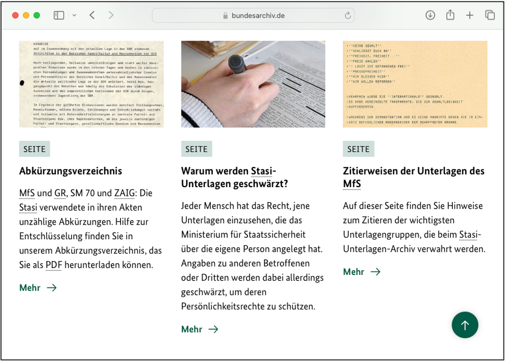 
Viele Recherchen führen über die eigene Institution hinaus, etwa in Stadt-, Kommunal-, Kreis-, Landes- oder Staatsarchive ebenso wie Wirtschaftsarchive. Auch Unterlagen zu beteiligten Personen oder Institutionen können wichtig sein, zum Beispiel Testamente, Korrespondenzen, Fotografien, Reiseberichte oder Tagebücher. In bestimmten Fällen, z.B. im NS-Kontext, können Recherchen auch in ausländische Archive führen, wenn sich Spuren in die ehemals besetzten Gebiete oder internationale Handelsnetzwerke verfolgen lassen.

--- 

#### Datenbanken und Tipps

Es gibt eine Vielzahl an Ressourcen für die Provenienzforschung! An dieser Stelle wird eine kleine Auswahl vorgestellt.

Datenbanken
======

 
<b>ProNto – Provenienzforschung-Navigator</b>

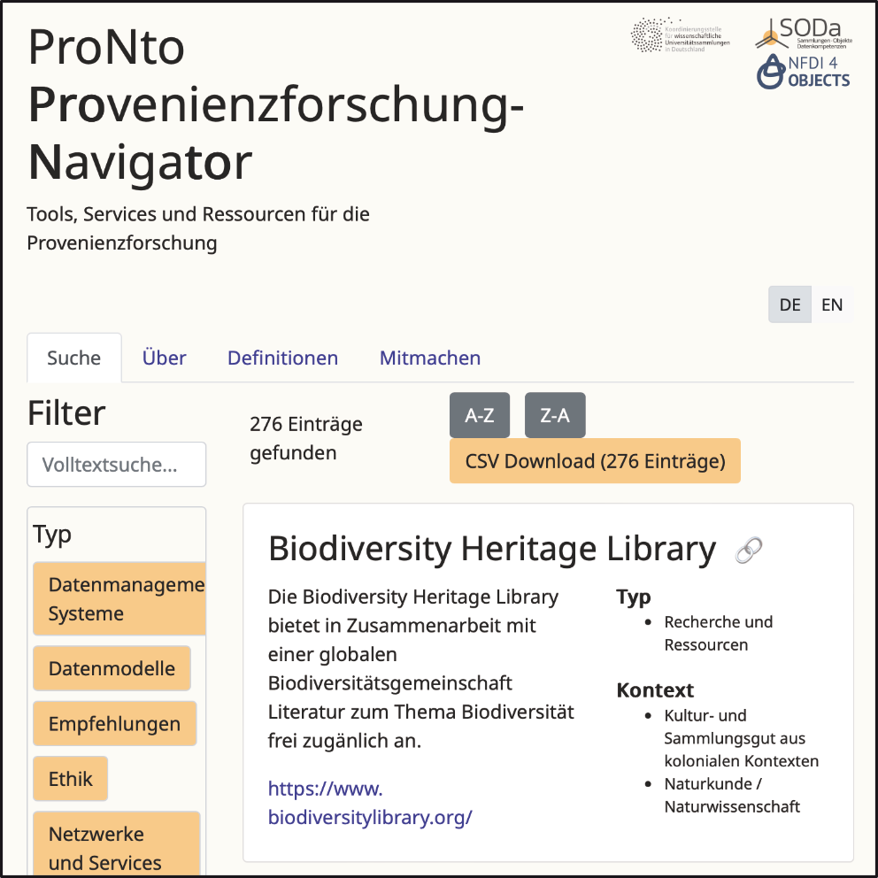

ProNto bündelt Ressourcen für die Provenienzforschung an einem Ort. Dazu gehören Datenbanken, Tools, Leitfäden, Handreichungen und Netzwerke. Die Einträge können nach Ressourcentypen und Entzugskontexten gefiltert werden.

* über 200 Ressourcen, Tools und Leitfäden
* Filterung nach Ressourcentypen und Kontexten
* Export der Ergebnisse als CSV-Datei möglich

https://tools.wissenschaftliche-sammlungen.de/pronto/

 
<b>Proveana</b>

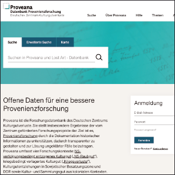

Die Proveana ist die Forschungsdatenbank des Deutschen Zentrums Kulturgutverluste. Sie macht Ergebnisse geförderter Provenienzforschungsprojekte zugänglich und bietet Themenschwerpunkte, Literaturhinweise, Ausstellungen sowie ein Glossar.

* Forschungsdatenbank des Deutschen Zentrums für Kulturgutverluste (DZK)
* Ergebnisse der vom DZK geförderten Projekte
* umfangreiches Glossar zu Begriffen der Provenienzforschung

https://www.proveana.de

 
<b>Lost Art</b>

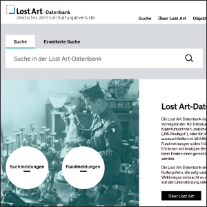

Die Lost Art-Datenbank wird ebenfalls vom Deutschen Zentrum Kulturgutverluste betrieben. Sie verzeichnet vor allem Kulturgüter, die jüdischen Personen zwischen 1933 und 1945 entzogen wurden, sowie kriegsbedingt verlagerte Kulturgüter.

* Datenbank Deutschen Zentrum Kulturgutverluste (DZK)
* Such- und Fundmeldungen zu NS-verfolgungsbedingt entzogenem Kulturgut
* Meldungen zu Kriegsverlusten des Zweiten Weltkriegs

https://www.lostart.de

 
<b>Getty Provenance Index</b>

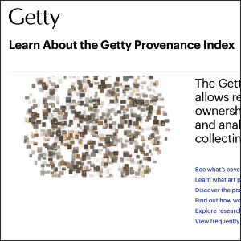

Der Getty Provenance Index enthält Provenienzinformationen aus historischen Quellen. Die Daten geben Hinweise auf Personen, Objekte, Orte, Ereignisse und Transaktionen. Sie können besonders hilfreich sein, um Kunsthandelswege, frühere Sammlungen, Verkäufe oder Besitzwechsel nachzuvollziehen. Die Daten werden schrittweise als verknüpfte offene Daten auf der Plattform Arches bereitgestellt, einer graphbasierten Infrastruktur zur Modellierung und Verknüpfung von Kulturerbedaten; ursprüngliche Datensätze sind weiterhin über den Legacy Index zugänglich.

* Provenienzdaten aus historischen Dokumenten
* Händlerbestandsbücher, Verkaufskataloge, Inventare sowie Informationen zu Sammler:innen
* Informationen zu Personen, Transaktionen (u.a. Zahlungen an Künstler:innen), Objekten, Orten, Ereignissen
* Arches: https://www.getty.edu/projects/arches/ 
* Legacy Index: https://piprod.getty.edu/starweb/pi/servlet.starweb?path=pi/pi.web

https://www.getty.edu/research/provenance/ 

 
<b>German Sales</b>

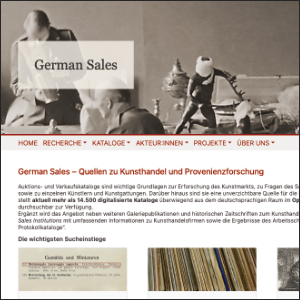

German Sales stellt digitalisierte Auktions- und Verkaufskataloge sowie weitere Galeriepublikationen bereit. Die Sammlung ist im Open Access verfügbar und im Volltext durchsuchbar. Der Schwerpunkt liegt auf dem deutschsprachigen Raum und dem Zeitraum 1901 bis 1945.

* mehr als 14.500 digitalisierte Kataloge und Galeriepublikationen
* Volltextsuche und Recherche nach Metadaten
* wichtige Quelle für Kunsthandel und Provenienzforschung

 

https://digi.ub.uni-heidelberg.de/germansales/ 

Tipps zum Rechercheeinstieg
======
Für jeden Kontext gibt es eigene Einstiegspunkte in die Recherche. Hier ist eine Auswahl zum Anfangen zusammengefasst.

 
<b>Recherche NS-Zeit</b>

Für den Einstieg in die Recherche zu NS-verfolgungsbedingt entzogenem Kulturgut eignen sich insbesondere Leitfäden, spezialisierte Datenbanken und Schulungsangebote. Sie bieten Überblickswissen, Recherchewege und Hinweise auf relevante Quellenbestände.

* Deutsches Zentrum Kulturgutverluste, Arbeitskreis Provenienzforschung e.V., Deutscher Bibliotheksverband, Deutscher Museumsbund, & ICOM Deutschland (Hrsg.). (2019). Leitfaden Provenienzforschung: Zur Identifizierung von Kulturgut, das während der nationalsozialistischen Herrschaft verfolgungsbedingt entzogen wurde, https://kulturgutverluste.de/sites/default/files/2023-04/Leitfaden-Download.pdf
* Jewish Digital Recovery Project (JDCRP): bietet kostenfreie Online-Seminare (2x pro Jahr) zu NS-Raubkunst: Wie kann ich das recherchieren? 
  * Online-Seminar: https://de.jdcrp.org/ns-raubkunst-online-seminar/
  * ausführliche Link-Liste: http://de.jdcrp.org/wp-content/uploads/Linkliste_Onlineseminar_JDCRP-ZI-TU_Modul.pdf
  * JDCRP Legacy Explorer: https://explorer.rjlegacy.org

 
<b>Recherche koloniale Kontexte</b>

Für koloniale Kontexte sind Ressourcen hilfreich, die historische Ortsbezeichnungen, koloniale Verwaltungsstrukturen, beteiligte Akteur:innen und Sammlungskontexte erschließen. Auch Leitfäden und Überblickspublikationen bieten gute Einstiegspunkte.

* Ahrndt, W., & Deutscher Museumsbund e.V. (Hrsg.). (2021). Leitfaden zum Umgang mit Sammlungsgut aus kolonialen Kontexten (3. Aufl.). Deutscher Museumsbund e.V. https://www.museumsbund.de/publikationen/leitfaden-zum-umgang-mit-sammlungsgut-aus-kolonialen-kontexten/ 
  * siehe insbesondere den Anhang mit ehemaligen Kolonialgebieten für ehemalige Schreibweisen
* Archivführer Kolonialzeit: https://archivfuehrer-kolonialzeit.de
* Grimme, G., Hüsgen, J., & Müller, L. (2024). Digital Resources for Researching Materials from Colonial Contexts in Libraries, Archives and Museums & University Collections. https://doi.org/10.18452/30911

 
<b>Recherche SBZ / DDR</b>

Für die Recherche zu Kulturgutentziehungen in der SBZ und der DDR sind historische Hintergrundinformationen, Fallbeispiele und Archivzugänge besonders wichtig. Zentrale Themen sind unter anderem Bodenreform, Republikflucht, staatlicher Kunsthandel und Vermögensentziehungen.

* Scheunemann, J., & Sachse, A. (2024). Kulturgutentzug in der Sowjetischen Besatzungszone und der DDR: Historische Hintergründe, Praxisbeispiele und Rechercheansätze. Eine Handreichung für Museen (Museumsverband Sachsen-Anhalt & Museumsverband des Landes Brandenburg, Hrsg.). https://www.museen-brandenburg.de/themen/provenienzforschung/handreichung-kulturgutentzug-sbz-ddr 
* Bundesarchiv – Quellen zu Kulturgutverlagerungen in SBZ und DDR (1945–1990): https://www.bundesarchiv.de/im-archiv-recherchieren/archivgut-recherchieren/nach-themen/quellen-zu-kulturgutentzug-kulturgutverlagerungen/1945-1990-kulturgutentzug-kulturgutverlagerungen-in-der-sowjetischen-besatzungszone-und-der-deutschen-demokratischen-republik/ 
* Bundesstiftung Aufarbeitung der SED-Diktatur: https://www.bundesstiftung-aufarbeitung.de

---

#### Allgemeine Recherche-Tipps

Viele Datenbanken bieten Funktionen, mit denen Suchanfragen erweitert oder präzisiert werden können. Besonders hilfreich sind Trunkierungen, Platzhalter, Suchschlüssel und boolesche Operatoren.

 
<b>Trunkieren „*“</b>

Mit einer Trunkierung wird nach einem Wortstamm und verschiedenen Wortendungen gesucht. Dafür wird meist ein Sternchen an den Wortstamm gesetzt. Trunkierungen sind hilfreich, wenn verschiedene Wortformen oder zusammengesetzte Begriffe berücksichtigt werden sollen.

> **Beispiel**
> 
> Raub* findet unter anderem „Raub“, „Raubgut“, „Raubkunst“ oder „Raubgüter“
> 
> 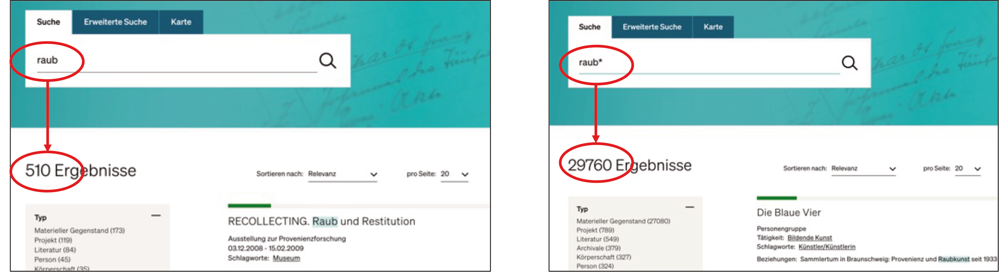

 
<b>Platzhalter „?“</b>

Platzhalter stehen für unbekannte oder unterschiedliche Buchstaben innerhalb eines Suchbegriffs. Häufig wird dafür ein Fragezeichen „?“ verwendet. Platzhalter sind besonders nützlich bei Namen, historischen Schreibweisen oder unsicheren Transkriptionen.

> **Beispiel** 
> 
> L?vy findet unterschiedliche Schreibweisen, in diesem Fall sowohl „Levy“ als auch „Lévy“. 
> 
> 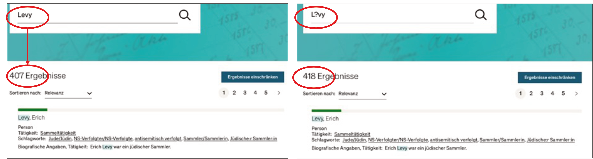

 
<b>Suchschlüssel</b>

Suchschlüssel legen fest, in welchem Feld einer Datenbank gesucht wird, zum Beispiel im Titel, in der Objektart, bei Personen oder bei Ortsangaben. So können Treffer gezielter eingegrenzt werden. 

> **Beispiel**
> 
> Wird beispielsweise nach einem Gemälde gesucht, das eine Straße zeigt, kann eine allgemeine Suche nach „Gemälde Straße“ zu viele oder ungenaue Treffer liefern. Präziser ist es, in der erweiterten Suche „Gemälde“ im Feld „Objektart“ und „Straße“ im Feld „Titel“ einzugeben. Dadurch werden nur die relevanten Felder durchsucht und die Trefferliste wird genauer.
> 
> 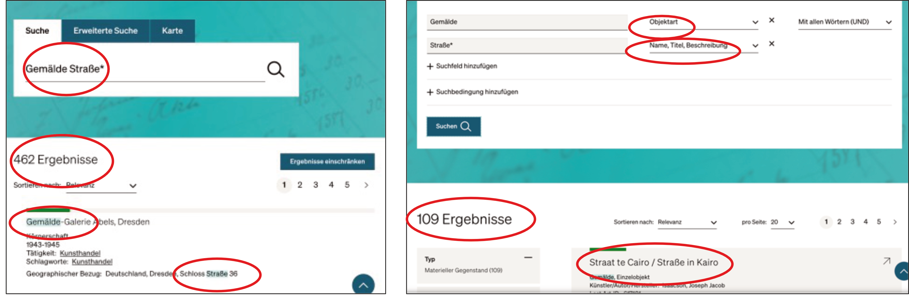

 
<b>Boolesche Operatoren</b>

Boolesche Operatoren ermöglichen es, mehrere Suchbegriffe miteinander zu kombinieren und dadurch eine Suche zu erweitern oder einzugrenzen.

> * UND: alle Begriffe müssen vorkommen. Beispiel „Rothschild UND Provenienz“
> * ODER: mindestens einer der Begriffe muss vorkommen. Beispiel: „Sammlung ODER Händler“
> * NICHT: bestimmte Begriffe werden ausgeschlossen. Beispiel: „Rothschild NICHT Bank“ 
> 
> 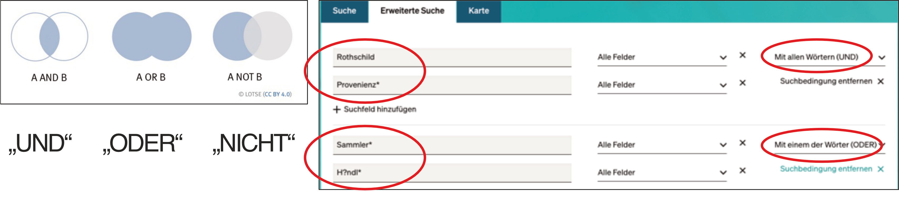

### Themenbereich 2: Übungen

Auf dieser Seite können Sie sowohl neu angeeignetes Wissen prüfen als auch einige praktische Übungen zur Recherche finden.

Fragebogen
=========
                            {{1}}

                          --{{2}}--
Welcher Zeitraum ist für die Recherche nach NS-verfolgungsbedingt entzogenem Kulturgut besonders relevant? 

(Single-Choice)

- [( )] 1871-1918
- [( )] 1918-1933
- [(X)] 1933-1945
- [( )] 1945-1990
                            {{2}}

                          --{{3}}--

Welche Objektgruppen können im NS-Kontext relevant sein?

(Single-Choice)

- [( )] ausschließlich Gemälde und Skulpturen aus staatlichen Museen
- [( )] vor allem technische Geräte aus Universitätssammlungen
- [(X)] von Alltagsgegenständen wie Büchern und Möbeln über Judaica bis zu Kunstwerken
- [( )] nur Objekte, die 1945 in Central Collecting Points registriert wurden

                            {{3}}

                          --{{4}}--

Welche Begriffe und Kontexte sind für NS-verfolgungsbedingten Entzug einschlägig?

(Multiple-Choice)

- [[x]] „Entartete Kunst“, Judenvermögensteuer, „Judenauktionen“
- [[ ]] Bodenreform, Republikflucht, Kunst und Antiquitäten GmbH, VermG
- [[ ]] Leihvertrag, Besitz, Eigentum, Werkverzeichnis
- [[x]] Einsatzleiter Reichsstab Rosenberg, Sonderauftrag Linz, Central Collecting Points

                            {{4}}

                          --{{5}}--

Welche Begriffe und Kontexte sind für NS-verfolgungsbedingten Entzug einschlägig?

(Multiple-Choice)

- [[x]] Judenvermögensteuer
- [[ ]] Kunst und Antiquitäten GmbH
- [[ ]] Leihvertrag
- [[x]] Sonderauftrag Linz

                            {{5}}

                          --{{6}}--

Welcher Zeitraum ist für die Recherche zu kolonialen Kontexten besonders relevant?

(Single-Choice)

- [[ ]] ab 1945-1949
- [[ ]] 1933-1945
- [[X]] 1870-1930
- [[ ]] 1949-1990

                            {{6}}

                          --{{7}}--

Welche Objektgruppen können in kolonialen Kontexten relevant sein?

(Multiple-Choice)

- [[X]] Alltagsgegenstände, Geräte, Secret/Sacred Objects
- [[X]] menschliche Überreste
- [[X]] Fotografien, Film- und Tonaufnahmen sowie Waren der Konsumkultur
- [[ ]] ausschließlich die Benin-Bronzen

                            {{7}}

        --{{8}}--

Welche Kontexte sind für koloniale Provenienzforschung besonders einschlägig?

(Multiple-Choice)

- [[ ]] „Judenauktionen“
- [[X]] Forschungs- und Missionsreisen
- [[X]] Strafexpeditionen
- [[ ]] Republikflucht

                            {{8}}

                            --{{9}}--

Welche Personen oder Körperschaften können in kolonialen Kontexten besonders relevant sein?

(Multiple-Choice)

- [[ ]] die alliierten Militärbehörden nach 1945
- [[X]] Reichskolonialamt
- [[X]] Forschungseinrichtungen
- [[X]] Museen

                            {{9}}

                            --{{10}}--
Welche Personen oder Körperschaften können in kolonialen Kontexten besonders relevant sein?

(Multiple-Choice)

- [[ ]] ausschließlich Künstler:innen (der Moderne)
- [[ ]] jüdische Personen
- [[x]] vor allem Herkunftsgesellschaften
- [[x]] koloniale Verwaltungsbeamte

        {{10}}

                            --{{11}}--
Welche Objektgruppen können in SBZ-/DDR-Kontexten relevant sein? 

(Multiple-Choice)

- [[X]] religiöse und zeremonielle Objekte
- [[X]] Alltagsgegenstände wie Geschirr und Möbel
- [[X]] Kunstwerke
- [[X]] Dokumente in Stadtarchiven

        {{11}}

                            --{{12}}--
Welche historischen Kontexte sind für Kulturgutentziehungen in SBZ und DDR besonders einschlägig?

(Multiple-Choice)

- [[X]] Schlossbergungen
- [[ ]] Einsatzstab Reichsleiter Rosenberg
- [[X]] Bodenreform
- [[X]] Republikflucht

        {{12}}

--{{13}}--
Welche Personen oder Köperschaften können in SBZ-/DDR-Kontexten besonders relevant sein?

(Multiple-Choice)

- [[X]] Großgrundbesitzer:innen, Adel
- [[X]] Privatpersonen wie Sammler:innen oder Republikflüchtlinge
- [[X]] Bodenreform, Schlossbergung, Republikflucht, Strafverfahren, staatlicher Kunsthandel zur Devisenbeschaffung, Volkseigentum
- [[X]] staatliche/kirchliche/wirtschaftliche Institutionen

Rechercheübung
==========
                          --{{1}}--
Öffnen Sie die erweiterete Suche auf der [Proveana Webseite](https://www.proveana.de/de/start) und testen Sie verschiedene Suchstrategien. Vergleichen Sie jeweils die Trefferzahlen. Notieren Sie, welche Suchstrategie die Treffer erweitert und welche sie präzisiert.

                            {{1}}

                          --{{2}}--
Suchen Sie in der Proveana-Datenbank nach „Sammlung“ und anschließend nach „*Sammlung“. 

(Single-Choice)

- [( )] „Sammlung“ bringt mehr Treffer bei einer Suche
- [(X)] „*Sammlung“ bringt mehr Treffer bei einer Suche
- [( )] Beide Varianten bringen gleich viele Treffer

                            {{2}}

                          --{{3}}--

Suchen Sie in der [Proveana Webseite](https://www.proveana.de/de/start) nach „Mayer“ und anschließend nach „M?yer“. Welche Aussagen treffen zu? 

(Multiple Choice)

- [[X]] Eine Suchanfrage nach „M?yer“ liefert Suchergebnisse sowohl für „Mayer“ als auch für „Meyer“.
- [[X]] Diese Recherchestrategie ist hilfreich bei einer unsicheren oder uneinheitlichen Schreibweise eines Namens.
- [[ ]] „M?yer“ bringt weniger Treffer als „Mayer“.

                            {{3}}

                            --{{4}}--   

Sie suchen nach einem Gemälde mit einer Kirche, kennen aber weder Titel noch Künstlernamen. Suchen Sie in der [Proveana Webseite](https://www.proveana.de/de/start) zunächst über die reguläre Suche nach den Begriffen „Gemälde Kirche“.  Notieren Sie die Trefferzahl und beurteilen Sie die Qualität der Treffer. Wiederholen Sie die Suche anschließend in der „Erweiterten Suche“ im Feld „Objektart:“ „Gemälde“ ein und im Feld „Name, Titel, Beschreibung:“ „Kirche“. 
Welche Aussagen treffen zu?

(Multiple Choice)

- [[X]] Bei der regulären Suche kommen auch viele irrelevante Treffer, z.B. eine Straßenszene, ein Gemälde von Ernst Ludwig Kircher.
- [[ ]] Bei der regulären Suche kommen weniger Treffer.
- [[X]] Man könnte die „Erweitere Suche“ durch weitere Suchfelder präzisieren, z.B. über „Material, Technik“ oder „Datum, Datierung“.

                          {{4}}

                            --{{5}}--  
Sie recherchieren nach Gemälden aus der Sammlung Rothschild. Suchen Sie in der [Proveana Webseite](https://www.proveana.de/de/start) nacheinander nach „(Objektart) Gemälde UND (Institution/Person/Sammlung) Rothschild“, „(Objektart) Gemälde UND (Institution/Person/Sammlung) Rothschild“ ODER „(Objektart) Gemälde NICHT (Institution/Person/Sammlung) Rothschild“. Vergleichen Sie die Trefferzahlen und die Relevanz der Ergebnisse.

(Multiple Choice)

- [[X]] Die Suche nach „(Objektart) Gemälde UND (Institution/Person/Sammlung) Rothschild“ bringt die wenigsten und relevantesten Treffer.
- [[ ]] Die NICHT-Suche eignet sich besonders gut, um Gemälde aus der Sammlung Rothschild zu recherchieren.
- [[X]] Mit ODER werden auch Datensätze gefunden, die nur einen der beiden Begriffe enthalten. Die Trefferzahl ist daher höher als bei der UND-Suche.

---

## 3. Strukturierung von Provenienzangaben
In dieser Einheit geht es um die Relevanz standardisierter Provenienzangaben, den Umgang mit unvollständigen, unsicheren oder widersprüchlichen Informationen, den Leitfaden zur Standardisierung von Provenienzangaben (2018), Qualitätskriterien für nachvollziehbare Provenienzangaben, Metadaten, Normdaten und kontrollierte Vokabulare sowie Metadatenschemas und eine ereigniszentrierte Datenmodellierung.

> **Lernziele**
> 
> * Probleme uneindeutiger, unvollständiger oder widersprüchlicher Provenienzangaben erkennen
> * erläutern, warum Provenienzangaben für die Veröffentlichung und Nachnutzung strukturiert erfasst werden sollten
> * zentrale Qualitätskriterien strukturierter Provenienzangaben benennen
> * Unsicherheiten, Lücken, Forschungsstände und Quellenangaben nachvollziehbar dokumentieren
> * Personen, Körperschaften, Orte, Zeitangaben, Erwerbungsarten und Quellen als zentrale Bestandteile von Provenienzangaben unterscheiden
> * die Relevanz von Metadaten, Normdaten und kontrollierten Vokabularen für die digitale Provenienzforschung erläutern
> * ausgewählte Metadatenschemas und Portale für Provenienz- und Sammlungsdaten benennen
> * die ereigniszentrierte Erfassung als Grundprinzip strukturierter Provenienz- und Sammlungsdaten einordnen

---

### Warum Provenienzangaben strukturieren?

Provenienzangaben in Form einer Provenienzkette fassen Informationen zu Besitz-, Eigentums- und Standortwechseln eines Objekts zusammen. Damit diese Informationen nachvollziehbar, überprüfbar und nachnutzbar sind, sollten sie strukturiert erfasst werden. Dabei bieten die FAIR-Prinzipien eine wichtige Orientierung. FAIR steht für auffindbar (findable), zugänglich (accessible), interoperabel (interoperable) und nachnutzbar (reusable). 

Strukturierte Provenienzangaben helfen dabei, Personen, Körperschaften, Orte, Zeiträume, Erwerbungsarten und Quellen eindeutig zu erfassen. Sie machen außerdem Unsicherheiten und Forschungslücken sichtbar und erleichtern die Nachnutzung in Datenbanken, Portalen oder Publikationen.

Auffindbare und miteinander vernetzte Daten können außerdem Mehrarbeit vermeiden: Bereits vorhandene Forschungsergebnisse lassen sich leichter erkennen und nachnutzen und Verbindungen zwischen Objekten, Personen, Orten und Ereignissen lassen sich so besser analysieren und zeigen. 

F: auffindbar (findable)

Daten und Metadaten sollten eindeutig bezeichnet, ausführlich beschrieben und über Suchsysteme auffindbar sein. Dazu gehört auch die Nutzung von Persistenten Identifikatoren (PID) für ein eindeutiges und dauerhaftes Referenzieren. 

* F1. (Meta-) Daten erhalten eine global eindeutige und dauerhafte Kennung
* F2. Daten werden mit umfangreichen Metadaten beschrieben (siehe R1)
* F3. Metadaten enthalten eindeutig und explizit die Kennung der von ihnen beschriebenen Daten
* F4. (Meta-) Daten werden in einer durchsuchbaren Ressource registriert oder indiziert

A: zugänglich (accessible)

Daten und Metadaten sollten über geeignete, möglichst offene und standardisierte Zugangswege dauerhaft online abrufbar sein. Zugänglich bedeutet dabei nicht, dass alle Daten uneingeschränkt öffentlich verfügbar sein müssen. Zugangsbeschränkungen können beispielsweise zum Schutz personenbezogener Daten oder von Persönlichkeitsrechten erforderlich sein.

* A1. (Meta-) Daten können anhand ihrer Kennung unter Verwendung eines standardisierten Kommunikationsprotokolls abgerufen werden
  * A1.1 Das Protokoll ist offen, kostenlos und universell implementierbar
  * A1.2 Das Protokoll ermöglicht bei Bedarf ein Authentifizierungs- und Autorisierungsverfahren
* A2. Auf Metadaten kann zugegriffen werden, auch wenn die Daten nicht (mehr) verfügbar sind

I: interoperabel (interoperable)

Daten sollten mithilfe gemeinsamer Standards, Datenmodelle, Normdaten und kontrollierter Vokabulare so erfasst werden, dass sie systemübergreifend verknüpft und verarbeitet werden können.

* I1. (Meta-) Daten verwenden eine formale, zugängliche, gemeinsame und allgemein anwendbare Sprache für die Wissensrepräsentation
* I2. (Meta-) Daten verwenden Vokabulare, die den FAIR-Prinzipien folgen
* I3. Metadaten enthalten qualifizierte Verweise auf andere (Meta-) Daten

R: nachnutzbar (reusable)

Daten sollten ausreichend dokumentiert und mit eindeutigen Nutzungsbedingungen sowie Quellen- und Provenienzinformationen versehen sein, damit sie in anderen Forschungskontexten verwendet werden können.

* R1. (Meta-) Daten werden mit einer Vielzahl genauer und relevanter Attribute ausführlich beschrieben
  * R1.1. (Meta-) Daten werden mit einer eindeutigen und zugänglichen Datennutzungslizenz veröffentlicht
  * R1.2. (Meta-) Daten sind mit detaillierten Informationen über die Entstehung versehen
  * R1.3. (Meta-) Daten entsprechen domänenrelevanten Community-Standards

> [!NOTE] 📝 Zur Vertiefung
> * FAIR Principles. (o. J.). GO FAIR. Abgerufen 3. Juli 2026, von https://www.go-fair.org/fair-principles/
> * FAIRe Daten. (o. J.). Abgerufen 3. Juli 2026, von https://forschungsdaten.info/fdm-allgemein/veroeffentlichen-und-archivieren/faire-daten

---

### Leitfaden zur Standardisierung von Provenienzangaben (2018)

Der [Leitfaden zur Standardisierung von Provenienzangaben (2018)](https://kulturgutverluste.de/sites/default/files/2023-04/Leitfaden-Download.pdf) wurde von einer Arbeitsgruppe des Arbeitskreises Provenienzforschung entwickelt. Er enthält Empfehlungen für die textliche Dokumentation von Provenienzangaben, beispielsweise in Ausstellungskatalogen, Printpublikationen oder Objekttexten.

Auch für die digitale Erfassung bietet er einen grundlegenden Einstieg, insbesondere in die Darstellung von Besitz-, Eigentums- und Standortwechseln sowie den Umgang mit Wissenslücken. Darüber hinaus formuliert der Leitfaden Qualitätskriterien (Qk), die auch im digitalen Raum berücksichtigt werden sollten.

> [!IMPORTANT] ❗ Wichtig
> **Ziele**
> * Grundlage für Qualitätskriterien einer Provenienzangabe bzw. Provenienzkette 
>   * einheitliche Darstellung von Besitz- und Eigentums- sowie Standortwechseln
>   * transparente Kennzeichnung von Wissenslücken
>
> Vor allem für **Ausstellungstexte** und **Print-Publikationen** geeignet!

> [!NOTE] 📝 Zur Vertiefung
> * Andratschke, C., Hartmann, J., Poltermann, J., Reuter, B., Schmeisser, I., & Schöddert, W. (2018). Leitfaden zur Standardisierung von Provenienzangaben. https://www.arbeitskreis-provenienzforschung.org/wp-content/uploads/2022/10/Leitfaden_APFeV_online.pdf

---

#### Qk 1: Unsicherheiten sichtbar machen

Idealerweise lassen sich Provenienzen vollständig rekonstruieren. In der Praxis bleiben jedoch häufig Lücken, Unsicherheiten oder sogar widersprüchliche Informationen. Strukturierte Provenienzangaben sollten deshalb nicht nur gesichertes Wissen dokumentieren, sondern auch Unsicherheiten und Nicht-Wissen sichtbar machen.

Unsicherheiten können sprachlich markiert werden, zum Beispiel durch Begriffe wie „vermutlich“, „wohl“ oder „spätestens“. Für digitale Erfassungen sollten dafür möglichst einheitliche Begriffe oder kontrollierte Vokabulare verwendet werden. Wichtig ist außerdem, Unsicherheiten zu begründen, Quellen anzugeben und den Forschungsstand mit Datum zu dokumentieren.

Möglichkeiten
====

Provenienzampel

Die Provenienzampel macht den Forschungsstand auf einen Blick sichtbar. Sie wurde 2019 im [Leitfaden Provenienzforschung](https://kulturgutverluste.de/sites/default/files/2023-04/Leitfaden-Download.pdf) für den NS-Kontext beschrieben und kennzeichnet den Kenntnisstand zur Provenienz eines Objekts für den Zeitraum von 1933 bis 1945 anhand verschiedener Farben.

| Farbe            |  Erklärung |
| -------------------- | -----|
| 🟢 Grün| Die Provenienz ist für den Zeitraum zwischen 1933 und 1945 rekonstruierbar und unbedenklich. Sie schließt einen NS- verfolgungsbedingten Entzug aus, eine weitere Überprüfung ist nicht notwendig. |
| 🟡 Gelb   | Die Provenienz ist für den Zeitraum zwischen 1933 und 1945 nicht eindeutig geklärt, es bestehen Provenienzlücken oder sie ist nicht zweifelsfrei unbedenklich. Die Herkunft sollte weiter erforscht werden. |
| 🟠 Orange   | Die Provenienz ist für den Zeitraum zwischen 1933 und 1945 bedenklich, da Hinweise (z. B. »Red Flag« Names) auf einen Zusammenhang mit einem NS-verfolgungsbedingten Entzug vorliegen. Die Herkunft muss prioritär weiter erforscht werden; eine Meldung für die Lost Art-Datenbank sollte erfolgen.|
| 🔴 Rot | Die Provenienz ist für den Zeitraum zwischen 1933 und 1945 höchstwahrscheinlich oder eindeutig belastet. Neben der Suche nach heutigen Anspruchsberechtigten ist eine Meldung in die Lost Art-Datenbank angezeigt. | 
| ⚪ ⚫ Weiß oder Grau | Es konnten für die Zeit vor dem Erwerb durch die Institution keine Hinweise zur Provenienz gefunden werden.| 

> [!NOTE] 📝 Zur Vertiefung
> * Deutsches Zentrum Kulturgutverluste, Arbeitskreis Provenienzforschung e.V, Deutscher Bibliotheksverband, Deutscher Museumsbund, & ICOM Deutschland (Hrsg.). (2019). Leitfaden Provenienzforschung: Zur Identifizierung von Kulturgut, das während der nationalsozialistischen Herrschaft verfolgungsbedingt entzogen wurde. Deutsches Zentrum Kulturgutverluste. S. 89-90. https://kulturgutverluste.de/sites/default/files/2023-04/Leitfaden-Download.pdf 

Provenienzstatus

Der Umgang mit Unsicherheiten ist nicht einheitlich standardisiert. Einrichtungen können daher auch andere Modelle verwenden. Die Stiftung für Kunst, Kultur und Geschichte (SKKG) in Winterthur nutzt zum Beispiel eine prozessorientierte Kategorisierung:

| Bezeichnung            |  Erklärung |
| -------------------- | -----|
| in Arbeit| Das Werk wird derzeit erforscht. Wenn sich Hinweise auf einen NS-verfolgungsbedingten Entzug ergeben, wird bei der Unabhängigen Kommission SKKG ein Antrag auf Verfahrenseröffnung gestellt. |
| klar   | Es liegen keine Hinweise auf einen NS-verfolgungsbedingten Entzug vor. |
| geklärt | Eine Einigung der Parteien oder ein Entscheid der Unabhängigen Kommission SKKG  liegt vor. Die Provenienz wurde entsprechend gewürdigt. |
| ungeklärt | Die Provenienz wirft noch Fragen auf. Die Datenlage erlaubt es bislang nicht, das  Werk der Unabhängigen Kommission SKKG zur Beurteilung einzureichen. Das Werk tritt in die reaktive Phase ein. Gehen Informationen von außen ein, erhält es wieder den Status «in Arbeit». In diese Kategorie gehören auch Gemälde mit einem Ankaufswert unter 5000 Franken. | 

 , Plage ciel mauve, 1903, Öl auf Leinwand, 69 × 50 × 2 cm, Inv. 1523, Stiftung für Kunst, Kultur und Geschichte, Winterthur, 1979. https://digital.skkg.ch/object/1676")

> [!NOTE] 📝 Zur Vertiefung
> * Lange, C., Schmutz, T., & Vedani, C. (2026, Juni). Provenienzforschung in der SKKG. Informationsbroschüre (Stiftung für Kunst, Kultur und Geschichte (SKKG), Hrsg.). S. 5-6, https://cms.skkg.ch/uploads/documents/Provenienz/Informationsbroschuere-Provenienforschung-SKKG_DE.pdf

Tagging von Datensätzen in kolonialen Kontexten

Der von Katja Kaiser und Catarina Madruga entwickelte Decision Tree unterstützt naturkundliche Sammlungen dabei, Objekte systematisch auf koloniale Kontexte zu prüfen. Im dreistufigen Ablauf werden zunächst Angaben zu Ort und Zeit sowie ergänzende Informationen zu Einliefernden ermittelt (Identify), anschließend anhand verlässlicher Quellen überprüft (Check) und schließlich als „kolonialer Kontext gesichert“, „kein kolonialer Kontext“ oder „in Prüfung“ gekennzeichnet (Tag); dabei werden auch die verwendeten Quellen, widersprüchliche oder unzureichende Daten und der weitere Forschungsbedarf dokumentiert.

 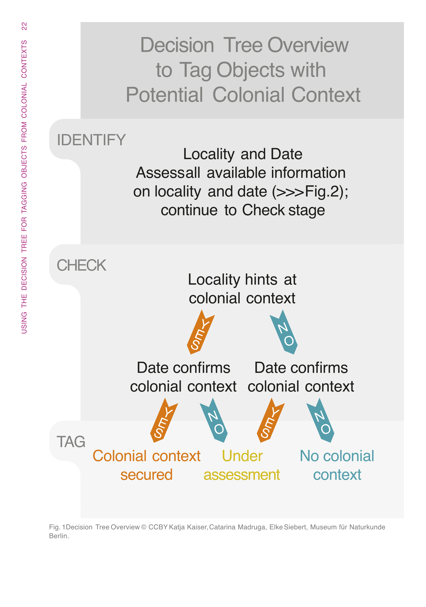
 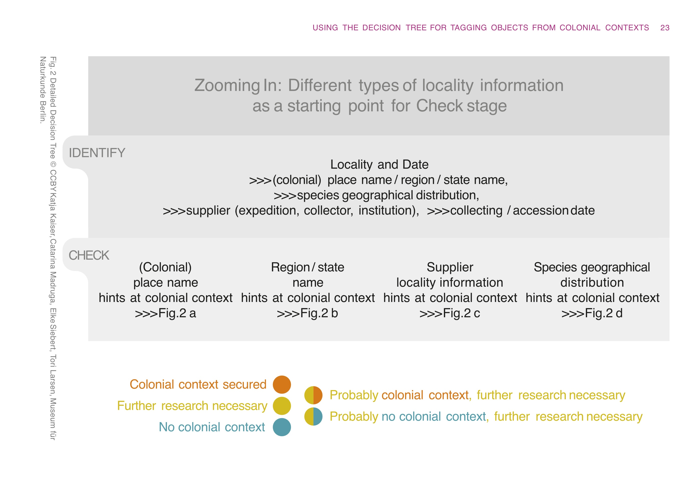
  Ortsnamen auf einen kolonialen Kontext hindeuten, © CC BY 4.0 Katja Kaiser, Catarina Madruga, Elke Siebert, Tori Larsen, Museum für Naturkunde Berlin")
 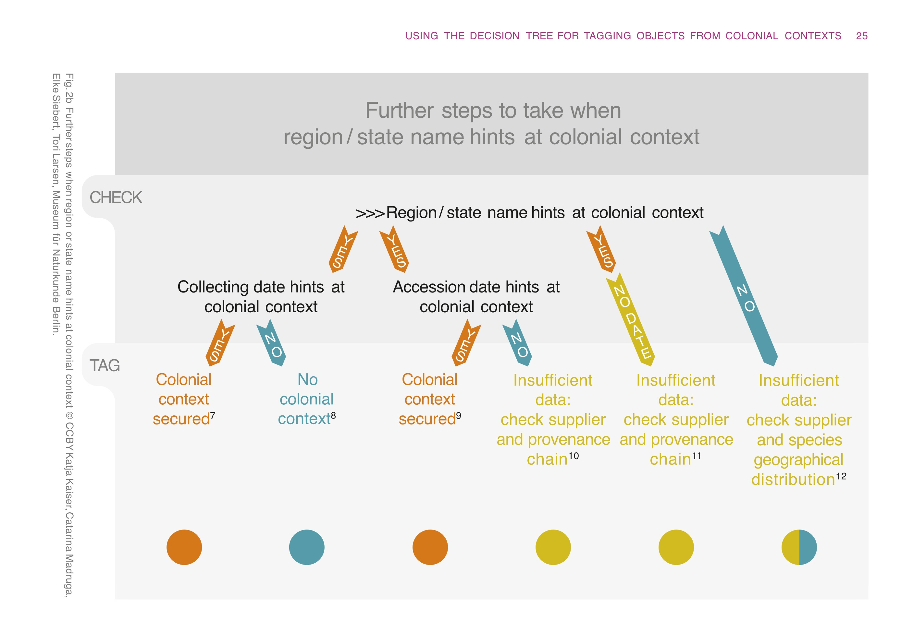
 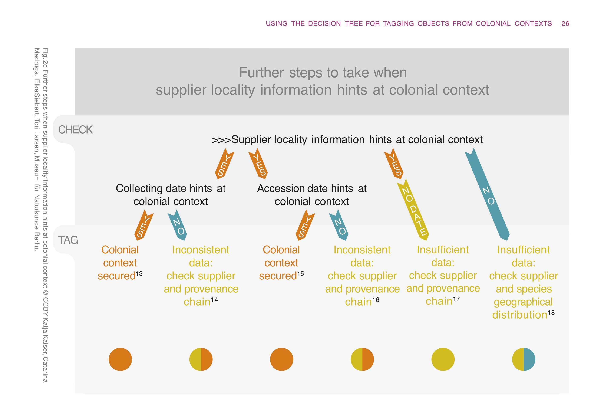
 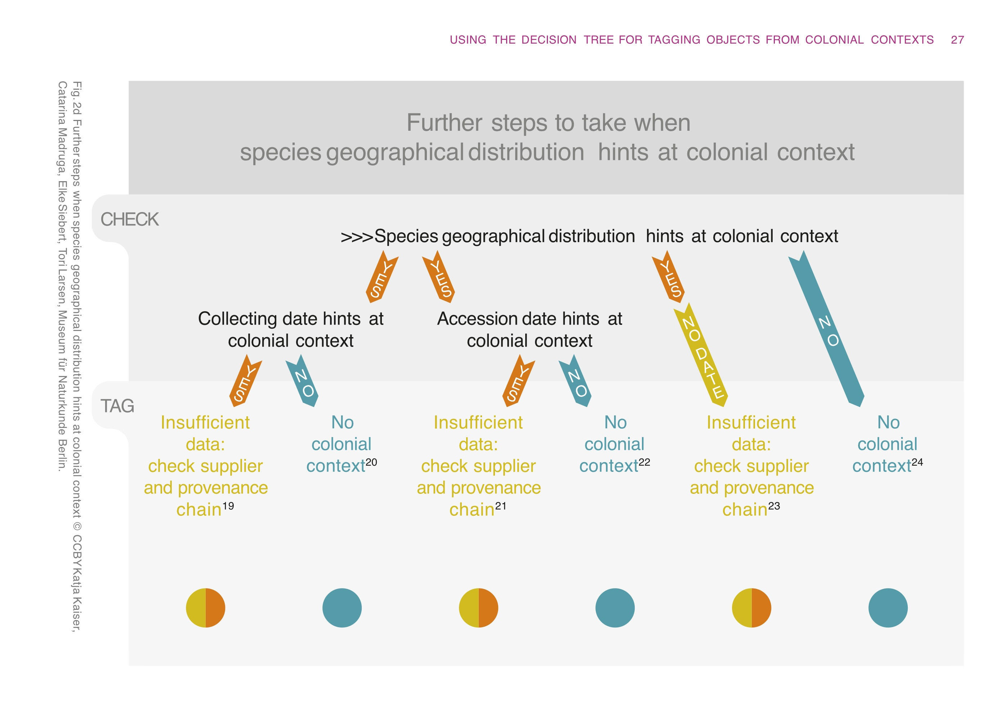

> [!NOTE] 📝 Zur Vertiefung
> Kaiser, K., & Madruga, C. (2024). Tagging Objects from Colonial Contexts: A Decision Tree for Natural History Collections. Working Paper Deutsches Zentrum Kulturgutverluste, 7. https://doi.org/10.25360/01-2024-00005 

> [!NOTE] 📝 Zur Vertiefung
> * Ehlers, D., Barsch, S., & Jetter, H.-C. (2025, November 28). Unsicherheit Sichtbarkeit verleihen. Visualisierungsstrategien für Unsicherheit in kolonialen Sammlungskontexten. Digital Turn. Sammlungen – Provenienzen – Märkte (Digital Turn), Berlin. Zenodo. https://doi.org/10.5281/zenodo.17787268 
> * Mariani, F. (2023). Introducing VISU: Vagueness, Incompleteness, Subjectivity, and Uncertainty in Art Provenance Data. Computational Methods in the Humanities. Proceedings of the Workshop on Computational Methods in the Humanities 2022 Lausanne, Switzerland, June 9-10, 2022, 63-84. https://ceur-ws.org/Vol-3602/paper5.pdf
> * AAT-Vokabular für qualifiers, die Unsicherheiten ausdrücken: https://www.getty.edu/vow/AATHierarchy?find=&logic=&note=&subjectid=300435720 

---

#### Qk 2: Quellennachweise

Ein weiteres Qualitätskriterium sind eindeutige Quellennachweise. Aussagen zur Besitz- und Provenienzgeschichte sollten nachvollziehbar belegt und überprüfbar sein.

Der Leitfaden empfiehlt, Primär- und Sekundärquellen zu unterscheiden und widersprüchliche Quellenangaben transparent zu machen. Quellen müssen außerdem kritisch eingeordnet werden, da Überlieferungsfehler vorkommen können. So können etwa Zahlendreher, fehlerhafte Datierungen oder unplausible Angaben in Eingangsbüchern auftreten. Solche Angaben sollten transparent dokumentiert und als fehlerhaft bzw. unplausibel kommentiert werden.

Beispiel: Lyonel Feininger (1871–1956), Kirche von Niedergrunstedt, 1919

Wie Quellennachweise nutzerfreundlich dargestellt werden können, zeigt die Online-Datenbank des Provenienzforschungsprojekts Galerie des 20. Jahrhunderts. Die 1949 gegründete Galerie des 20. Jahrhunderts war eine Kunstsammlung des West-Berliner Senats, deren Bestände 1968 größtenteils in die Nationalgalerie überführt wurden. In einem gemeinsamen Forschungsprojekt untersuchten die Stiftung Preußischer Kulturbesitz und das Land Berlin die Provenienzen von rund 500 vor 1945 entstandenen Werken, insbesondere im Hinblick auf mögliche NS-verfolgungsbedingte Entziehungen. Als Ergebnis entstand eine Online-Datenbank, die die Besitz- und Eigentumsgeschichte der untersuchten Werke detailliert dokumentiert und mit Primärquellen sowie Literaturangaben belegt.

Das Beispiel der "Kirche von Niedergrunstedt" von Lyonel Feininger zeigt, wie in der Frontend-Darstellung die Provenienzkette in vertikaler Form dargestellt wird. Die einzelnen Elemente werden durch Kurzverweise auf die ausführlich erschlossenen Primärquellen (Q) und Literaturangaben (L) verknüpft und durch Informationen zu Provenienzspuren am Objekt ergänzt. Ein ausführlicher Fließtext erläutert leserfreundlich die Provenienzgeschichte des Objekts.

Zum Projekt: https://www.galerie20.smb.museum 

Zum Eintrag von Lyonel Feininger (1871–1956): Kirche von Niedergrunstedt, 1919: https://www.galerie20.smb.museum/werke/965405.html

 zu Lyonel Feininger (1871–1956), Kirche von Niedergrunstedt, 1919, Nationalgelerie, Staatliche Museen zu Berlin. https://www.galerie20.smb.museum/werke/965405.html")

> [!IMPORTANT] ❗ Wichtig
> * Aussagen zur Provenienzgeschichte mit Quelle(n) belegen
> * Primär- und Sekundärquellen unterscheiden 
> * widersprüchliche und unplausible Angaben transparent machen
> * wo erforderlich, Quellen kritisch einordnen 

---

#### Qk 3: Einheitliche Erfassungssprache

Werden Provenienzangaben wie z.B. Personen oder Institutionen frei formuliert, entstehen schnell unterschiedliche Schreibweisen, Mehrdeutigkeiten und schwer durchsuchbare Daten.

Für eine einheitliche Beschreibung sind deshalb kontrollierte Vokabulare, Thesauri und Normdaten wichtig. Sie helfen dabei, Begriffe konsistent zu verwenden und Personen, Körperschaften oder Orte eindeutig zu identifizieren.

 
<b>Kontrollierte Vokabulare</b>

> "System, in dem Begriffe gesammelt werden, die dazu dienen, die Beschreibung von Dingen zu vereinheitlichen. Die Begriffe werden innerhalb des kontrollierten Vokabulars eindeutig identifiziert."
>
> 
 Deutsche Digitale Bibliothek. (2015). Normdaten. In DDBpro Glossar, https://pro.deutsche-digitale-bibliothek.de/glossar/kontrolliertes-vokabular Stand: 17.03.2026 

Kontrollierte Vokabulare sammeln festgelegte Begriffe für einen bestimmten Anwendungsbereich. Sie dienen dazu, Beschreibungen zu vereinheitlichen und Begriffe eindeutig identifizierbar zu machen.

Ein Beispiel ist das [DDB Provenienz-Vokabular](https://xtree-public.digicult-verbund.de/vocnet/?uriVocItem=http://ddb.vocnet.org/provenance/&startNode=p0030&lang=de&d=n). Es enthält Begriffe des Objekterwerbs, etwa Auktion, Ausgrabung, Diebstahl, Fund oder Tausch. Die Begriffe sind definiert und mit persistenten Identifikatoren versehen. Die Vorzugsbezeichnung stehen dreisprachig zur Verfügung (Deutsch, Englisch, Französisch). Es enthält außerdem Mappings zu anderen gängigen Vokabularen (AAT, GND, LCSH, RAMEAU und Wikidata).

> [!TIP] 💡 Tipp
> In [ProNto - Provenienzforschung-Navigator](https://tools.wissenschaftliche-sammlungen.de/pronto/) den Typ "Terminologie" auswählen und weitere Vokabulare finden.

 
<b>Thesauri</b>

> „Der Begriff Thesaurus […] bezeichnet einen 'Wort-Schatz', d.h. eine Sammlung aller Begriffe eines Anwendungsbereichs, z.B. einer Fachsprache. Dieses Wortmaterial wird nach seinen semantischen Beziehungen strukturiert und über ein Register alphabetisch erschlossen. […] Ein Thesaurus zeigt Ihnen zugehörige Ober- und Unterbegriffe, verwandte Begriffe und Synoynme [sic] […] an.“
>
> 
 Universitäts- und Landesbibliothek Münster. (n.d.). Thesaurus. In LOTSE, Universitäts- und Landesbibliothek Münster. https://www.ulb.uni-muenster.de/lotse/literatursuche/suchstrategien/tipps/thesaurus.html Stand: 17.03.2026 

Ein Thesaurus strukturiert Begriffe nach ihren Beziehungen zueinander. Er kann Ober- und Unterbegriffe, verwandte Begriffe, Synonyme oder historische Bezeichnungen abbilden.
Das ist zum Beispiel bei Ortsangaben hilfreich: Ein Thesaurus kann zeigen, dass Charlottenburg ein Stadtteil von Berlin ist oder, dass sich historische Ortsbezeichnungen wie Leningrad und Sankt Petersburg auf denselben Ort beziehen. Ein Beispiel für einen geografischen Thesaurus ist [GeoNames](https://www.geonames.org).

 
<b>Normdaten</b>

> „Bestandteil kontrollierter Vokabulare, die für die einheitliche Beschreibung zum Beispiel von Personen, Körperschaften, Ereignissen oder abstrakten Begriffen verwendet werden. Sie vereinheitlichen die Bezeichnungen und ermöglichen die eindeutige Identifizierung.“
>
> 
 Deutsche Digitale Bibliothek. (2015). Normdaten. In DDBpro Glossar. https://pro.deutsche-digitale-bibliothek.de/glossar/normdaten Stand: 17.03.2026 

Normdaten sind standardisierte Datensätze, mit denen Personen, Institutionen, Orte und andere Entitäten eindeutig identifiziert werden können. Sie legen eine bevorzugte Namensform fest und bündeln zusätzliche Informationen, wie Lebensdaten, Wirkungsformen oder alternative Schreibweisen. Ziel ist eine eindeutige Referenzierung, die es ermöglicht, Daten aus verschiedenen Quellen miteinander zu verknüpfen. 

 
<b>Normdaten in der GND</b>

Die wichtigste Normdatei im deutschsprachigen Raum ist die [Gemeinsame Normdatei](https://www.dnb.de/DE/Professionell/Standardisierung/GND/gnd_node.html), kurz GND. Die GND umfasst inzwischen rund zehn Millionen Datensätze und deckt unterschiedliche Arten von Entitäten ab, die auf der Grafik visualisiert sind. Für die Provenienzforschung sind vor allem Personen- und Körperschaftsdatensätze wichtig, z.B. für Kunsthändler:innen, Sammler:innen oder Institutionen sowie Geografika für Ortsangaben.

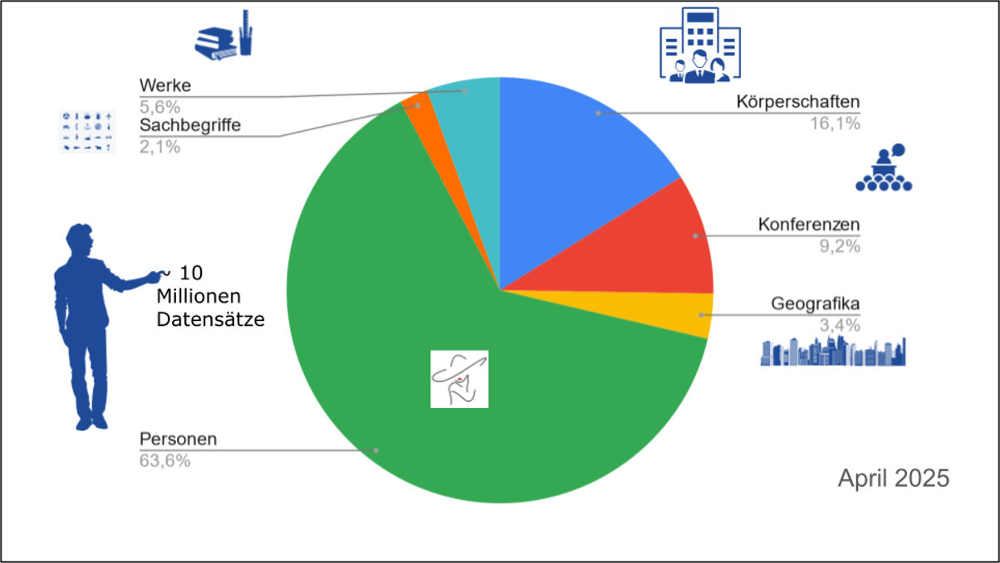

> [!TIP] 💡 Tipp
> Zur Suche eignet sich der GND Explorer: https://explore.gnd.network

 
<b>Normdaten, Beispiel: Ferdinand Möller </b>

Das Beispiel „Ferdinand Möller“ zeigt, warum Normdaten wichtig sind: Ohne weitere Angaben bleibt unklar, welche Person gemeint ist. Selbst der vollständige Name „Ferdinand Möller“ kann mehrere Treffer erzeugen. Erst die Verknüpfung mit einem eindeutigen GND-Datensatz legt fest, dass hier der Berliner Kunsthändler Ferdinand Möller gemeint ist.

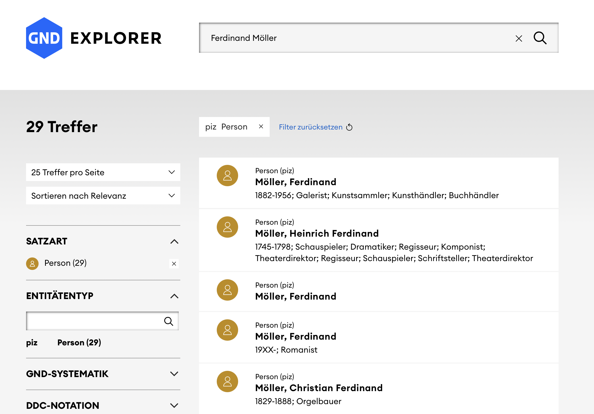
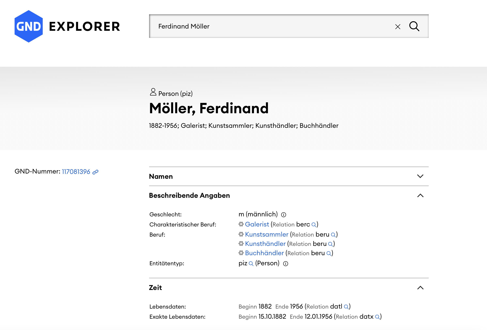

> [!NOTE] Zur Vertiefung
> * [Berthold et al. (erscheint 2026): Provenienzen dokumentieren: Leitfäden, Modelle und Vokabulare, DOI: folgt]
> * Frech, A., Gerber, A., Gnyp, A., Götsch, S., von Hagel, F., Kailus, A., Reichert, R., Schäfer, D., & Schlösser, M. (2026). FAIRe Vokabulare und Normdaten für Museen und Sammlungen (1.0.1). Zenodo. https://doi.org/10.5281/zenodo.1839133
> * Moeller, K., Purschwitz, A., & Köther, F. (2025). Kontrollierte Vokabulare und Normdaten der historisch arbeitenden Disziplinen (Version 2.0). Historisches Datenzentrum Sachsen-Anhalt. https://doi.org/10.5281/zenodo.17708554

---

#### Qk 4: Chronologie

Ein weiteres Qualitätskriterium ist die chronologische Nachvollziehbarkeit der Provenienz. Besitzstationen und Besitzwechsel sollten möglichst in zeitlicher Reihenfolge dokumentiert werden, idealerweise von der Herstellung des Objekts bis zum heutigen Standort.

Zeitangaben spielen dabei eine zentrale Rolle. Sie sollten so genau wie möglich erfasst werden. Ungefähre Angaben wie „vor“, „nach“, „spätestens“, „frühestens“ oder „um“ sind gut lesbar, aber für die maschinelle Verarbeitung nicht eindeutig. Für digitale Erfassungen sollten sie daher zusätzlich standardisiert und maschinenlesbar dokumentiert werden.

Eine Tabelle kann beides verbinden: eine menschenlesbare Zeitangabe im Freitextfeld und eine standardisierte Zeitangabe für die digitale Weiterverarbeitung.

, CC BY 4.0 Gabriele Zöllner")

> [!IMPORTANT] ❗ Wichtig
> * Provenienzstationen in chronologischer Reihenfolge dokumentieren
> * Zeitangaben klar kennzeichnen
>   * konkrete Daten oder Zeiträume: z.B. 1934-03-20
>   * relative Zeitangaben: vor, nach, spätestens, frühestens, um

---

#### Qk 5: Erfassungsstruktur

Ein weiteres Qualitätskriterium ist eine einheitliche Erfassungsstruktur. Der Leitfaden empfiehlt, Provenienzangaben in einzelne **Segmente** zu gliedern. Ein Segment entspricht in der Regel einer Besitzstation, also einer Person oder Körperschaft, die ein Objekt zu einem bestimmten Zeitpunkt verwahrte oder in deren Eigentum es sich befand.
Innerhalb eines Segments sollten zentrale Informationen in **Elemente** gegliedert werden, die jeweils durch festgelegte Satzzeichen getrennt werden. 

Der Leitfaden schlägt zwei mögliche Darstellungsformen für die Segmentierung vor: eine vertikale und eine horizontale Struktur. Innerhalb eines Segments folgen die Informationen einer festen Reihenfolge: Zeitangabe, Person oder Körperschaft, Ort, Erwerbungsart und schließlich der Quellenhinweis. 

, S. 13-14")

 
<b>Vertikale Struktur</b>

, Kirche von Niedergrunstedt, 1919, vgl. Leitfaden zur Standardisierung von Provenienzangaben, 2018, S. 29-30") 

In der vertikalen Struktur steht jede Besitzstation in einer eigenen Zeile. Dadurch lässt sich die Chronologie schnell erfassen, und Lücken oder Unsicherheiten werden gut sichtbar.

Diese Form eignet sich besonders für tabellarische Darstellungen und digitale Frontends.

> [!IMPORTANT] ❗ Wichtig
> * jede Besitzstation in einer eigenen Zeile
> * klar festgelegte Reihenfolge innerhalb des Segments
> * für Frontenddarstellungen zu bevorzugen
>   * Beispiel: Heiliger Ambrosius, um 1470, Staatsgalerie Stuttgart: https://www.staatsgalerie.de/de/sammlung-digital/heilige-ambrosius

 
<b>Horizontale Struktur </b>

, Kirche von Niedergrunstedt, 1919, vgl. Leitfaden zur Standardisierung von Provenienzangaben, 2018, S. 31-32") 

In der horizontalen Struktur werden die Besitzstationen hintereinander notiert und meist durch Semikolons getrennt. Inhaltlich werden dieselben Informationen dokumentiert wie in der vertikalen Struktur.

Diese Form ist kompakter und wird häufig in Ausstellungskatalogen, Objektbeschriftungen oder Freitextfeldern verwendet. Auch hier ist eine einheitliche Reihenfolge wichtig, damit die Angaben später besser ausgewertet oder in Tabellen überführt werden können, etwa mit Regular Expressions, Natural Language Processing oder Tools wie OpenRefine.

> [!IMPORTANT] ❗ Wichtig
> * gleiche Informationen wie in der vertikalen Darstellung
> * die Besitzstationen werden hintereinander notiert
> * Trennung über Semikolon

> [!TIP] 💡 Tipps
> 
> * PROV-A, the Provenance App ist ein Tool vom Provenance Lab der Leuphana Universität Lüneburg, das strukturierte Provenienz-Freitexte in Linked Open Data überführen kann.
>   * PROV-A, the Provenance App: https://prov-a.github.io 
> * Mit OpenRefine können Daten, die einem einheitlichen Erfassungschema folgen in Tabellen umgewandelt werden. 
>   * OpenRefne: https://openrefine.org/

---

### Erfassung von Provenienzangaben

Provenienzangaben können als Fließtext gut lesbar sein. Für digitale Recherchen, Datenbanken und Portale reicht das aber oft nicht aus. Damit Informationen gesucht, gefiltert, verglichen und weiterverwendet werden können, müssen sie strukturiert erfasst werden.
Aus einer frei formulierten Angabe wie „vermutlich vor 1933 im Besitz von Ferdinand Möller, Berlin“ können einzelne Informationen herausgelöst werden:

* Unsicherheit: vermutlich
* Zeitraum: vor 1933
* Person/Körperschaft: Ferdinand Möller
* Ort: Berlin
* Ereignis/Rolle: Besitz

Solche einzelnen Informationen können anschließend mit Quellen, Normdaten, kontrollierten Vokabularen oder weiteren Forschungsangaben verbunden werden. Dadurch werden Provenienzdaten nachvollziehbarer und besser nachnutzbar.

> [!IMPORTANT] ❗ Wichtig
> Strukturierte Daten helfen dabei, Provenienzangaben einheitlich zu erfassen, Personen, Orte, Zeiträume und Ereignisse gezielt zu suchen, Unsicherheiten und Quellen sichtbar zu machen und Daten in Portalen, Datenbanken und Forschungsprojekten weiterzuverwenden.

---

#### Metadaten

> "Metadaten beinhalten strukturierte Informationen über Daten (z. B. Forschungsdaten) oder andere Ressourcen und deren Merkmale. Sie werden entweder unabhängig von oder zusammen mit den Daten, die sie beschreiben, abgespeichert."
>
> 
Kommunikations-, Informations-, Medienzentrum (KIM) der Uni Konstanz. (2026). Metadaten. In Forschungsdaten.info: Praxis kompakt Glossar. https://forschungsdaten.info/praxis-kompakt/glossar/#c269911 Stand: 17.03.2026

Metadaten sind also vereinfacht gesagt „Daten über Daten“. Sie enthalten strukturierte Informationen über Daten, Objekte oder andere Ressourcen und machen diese identifizierbar, auffindbar und interpretierbar.

Im Forschungsdatenmanagement werden häufig verschiedene Arten von Metadaten unterschieden.

 
<b>Deskriptive Metadaten</b>

> [!NOTE] 
> Deskriptive Metadaten beschreiben ein Objekt und seinen Kontext. 

Im Sammlungskontext entspricht dies weitgehend der Objekterfassung oder Objektdokumentation. Deskriptive Metadaten beschreiben ein Objekt und seinen Kontext. Dazu gehören Angaben wie ein Objekttitel, der Objekttyp, eine Datierung sowie Materialangaben.

**Beispiel**

* Objekttitel: Stethoskop
* Objekttyp: Medizinisches Instrument
* Datierung: um 1900
* Material: Metall, Gummi
* Provenienzangaben: Besitzstationen, Erwerbsart, Zeitangaben

 
<b>Administrative Metadaten</b>

> [!NOTE]
> Administrative Metadaten regeln organisatorische, rechtliche oder technische Rahmenbedingungen.

Administrative Metadaten betreffen nicht in erster Linie den Inhalt eines Objekts, sondern die organisatorischen und rechtlichen Rahmenbedingungen seiner Nutzung und Verwaltung. Sie legen also fest, wie ein Objekt oder eine Datei verwaltet, dokumentiert oder genutzt werden darf. Dazu gehören Angaben zum Rechteinhaber einer Bilddatei oder zur Lizenz, unter der eine Datei veröffentlicht wird. In der Provenienzforschung kann hier auch auf den Forschungsstand verwiesen werden: z.B. durch die Provenienzampel.

**Beispiel**

* Rechteinhaber der Bilddatei
* Lizenz: z.B. CC BY 4.0 
* Digitalisierungsdatum 
* Erfassungsdatum/letzte Aktualisierung, Forschungsstand -> siehe Provenienzampel und Proveninezstatus

 
<b>Technische Metadaten</b>

> [!NOTE]
> Technische Metadaten beschreiben die digitale Datei, nicht das Objekt selbst.

Technische Metadaten beziehen sich auf die digitale Datei selbst und nicht auf das Objekt, das abgebildet und dokumentiert wird. 
Wenn wir zum Beispiel ein Objektfoto in einer Datenbank speichern, enthalten die technischen Metadaten Informationen über die Eigenschaften dieser Datei. 
Dazu gehört u.a. das Dateiformat z.B. TIFF oder JPEG, die Dateigröße, z.B. 10 Megabyte sowie die Auflösung der Datei, 
beispielsweise 300 dpi oder eine bestimmte Pixelgröße. 

**Beispiel**

* Dateiformat: TIFF, JPEG
* Dateigröße: 10 MB
* Auflösung: 300 dpi (z.B. 6000 x 4000 Pixel)
* Kameramodell: Pentax K-7

 
<b>Strukturelle Metadaten</b>

> [!NOTE]
> Strukturelle Metadaten beschreiben, wie einzelne Informationen verknüpft sind.

Strukturelle Metadaten beschreiben, wie einzelne Informationen miteinander verknüpft sind. Im Sammlungskontext bedeutet das zum Beispiel, 
dass eine Bilddatei mit den Erfassungsdaten eines Objekts verbunden wird, z.B. über eine gemeinsame Inventarnummer. 
Dadurch wird klar, welche Datei zu welchem Objekt gehört, und diese Beziehung kann auch von digitalen Systemen eindeutig verstanden und verarbeitet werden.

**Beispiel** 

* eine Verknüpfung einer Bilddatei mit den Erfassungsdaten eines Objektes z.B. über die Inventarnummer

Exkurs: Metadatenschemas
===

Ein Metadatenschema legt fest, welche Informationen zu einem Objekt oder einer Ressource erfasst werden, wie diese Informationen benannt werden und welche Felder verpflichtend oder wiederholbar sind.

Für die digitale Provenienzforschung sind Metadatenschemas wichtig, weil sie gemeinsame Regeln für die Beschreibung von Objekten, Provenienzangaben, Akteur:innen, Orten, Zeiträumen und Quellen bereitstellen. Sie helfen dabei, Daten aus verschiedenen Einrichtungen verständlicher, vergleichbarer und anschlussfähiger zu machen.

---

#### Beispiele im Sammlungs- und Provenienzkontext

In der Praxis gibt es verschiedene Standards, Empfehlungen und Modelle, die bei der Erfassung von Sammlungs- und Provenienzdaten helfen. Manche sind eher als konkrete Feldlisten oder Erfassungsschemas angelegt. Andere beschreiben stärker die Beziehungen zwischen Objekten, Personen, Orten, Zeiträumen, Ereignissen und Quellen. Häufig greifen beide Ebenen ineinander.

> [!IMPORTANT] ❗ Wichtig
> Für die Provenienzforschung ist besonders wichtig, dass Besitz-, Eigentums- und Standortwechsel nicht nur als Freitext dokumentiert werden. Sie sollten möglichst als einzelne, nachvollziehbare Stationen oder Ereignisse erfasst werden. Dadurch lassen sich Quellen, Unsicherheiten und Forschungsstände genauer zuordnen.

Es ist festzuhalten, dass eine ereignisbasierte Objekterfassung (in unterschiedlich starker Ausprägung) ein Standard /ein Qualitätskriterium einer strukturierten Erfassung in der (Digitalen) Provenienzforschung geworden ist. Die nachfolgenden Beispiele haben gemeinsam, dass sie objektgeschichtliche Ereignisse in unterschiedlicher Tiefe erfassen. Beim Minimaldatensatz ist dies bewusst niedrigschwellig gehalten: Er sieht mindestens ein Ereignis pro Objekt vor. Damit knüpfen die Beispiele an das Qualitätskriterium einer einheitlichen Erfassungsstruktur an.

 
<b>Datenfeldmatrix der Landesstelle für die nichtstaatlichen Museen in Bayern (2026)</b>

Die Datenfeldmatrix der Landesstelle für die nichtstaatlichen Museen in Bayern wurde für ein Provenienzforschungsmodul entwickelt. Ausgangspunkt ist NS-verfolgungsbedingt entzogenes Kulturgut; das Schema kann jedoch auch auf andere historische Entzugskontexte übertragen werden.

Die Provenienzkette setzt sich aus wiederholbaren Einzelelementen zusammen, die sich am Leitfaden zur Standardisierung von Provenienzangaben orientieren. Ein Segment umfasst unter anderem Datenfelder für:

* Datum von – bis 
* Person oder Köperschaft
* Herkunftsort
* Ereignis 
* Quellennachweis

Ergänzend können weitere Angaben erfasst werden, wie der Status der Provenienz, Links zu Lost Art oder Proveana, Handlungsempfehlungen zur weiteren Erforschung eines Objekts sowie Angaben zu Vorbesitzer, Zugangsart oder fairen und gerechten Lösungen.

> [!NOTE] 📝 Zur Vertiefung
> * Greisinger, S. (2026). Standards in der Erfassung von Museumsobjekten in der Provenienzforschung Datenfeldmatrix für ein Provenienzforschungsmodul. In C. Bach, M. Topp, & Landesstelle für die nichtstaatlichen (Hrsg.), „Und dann haben wir noch das hier …“ Provenienzforschung für Museen. Landesstelle für die nichtstaatlichen Museen in Bayern. https://museumsberatung-bayern.de/fileadmin/PDF-Dateien-Alt-System/Ab_2018_Material_Landesstelle/Veröffentlichungen/Arbeitshilfen/LST_Provenienzforschung.pdf

 
<b>Marburger Metadatenschema</b>

Das Marburger Metadatenschema wurde für die Sammlungen der Philipps-Universität Marburg entwickelt. Es bietet eine gemeinsame Dokumentationsstruktur für mehr als 30 Universitätssammlungen aus unterschiedlichen Fachdisziplinen und ist daher besonders auf die heterogenen Erschließungsbedarfe von Universitätssammlungen ausgerichtet.

Das Marburger Metadatenschema sieht für Provenienzangaben eine eigene Feldgruppe zu Ereignissen aus der Objektgeschichte vor. Diese Feldgruppe kann mehrfach verwendet werden, sodass verschiedene Stationen oder Ereignisse in der Geschichte eines Objekts einzeln erfasst werden können. Zu einem solchen Ereignis gehören Angaben zum Ereignistyp, zu beteiligten Personen oder Körperschaften und ihrer Rolle, zur Datierung, zum Ort sowie zu Quellen und ergänzenden Bemerkungen.

> [!NOTE] 📝 Zur Vertiefung
> * Maul, A. 2024. Vorschlag für ein gemeinsames Metadatenschema für die Sammlungen der Philipps-Universität Marburg. https://doi.org/10.17192/FDR/239

 
<b>Minimaldatensatz, MDS (Pflichtfelder)</b>

Der Minimaldatensatz ist ein fachübergreifender Mindeststandard für Sammlungsdaten. Er definiert Pflichtfelder für eine konsistente und anschlussfähige Objektdokumentation, zum Beispiel für Portale wie die Deutsche Digitale Bibliothek.

Ein zentrales Prinzip ist die Ereignislogik: Für jedes Objekt sollte mindestens ein Ereignis erfasst werden, etwa Herstellung oder Erwerb. In der Provenienzforschung lassen sich damit auch Besitz- und Eigentumswechsel beschreiben.

* fachübergreifender Mindeststandard für Sammlungsdaten 
* Pflichtfelder für eine anschlussfähige Sammlungserschließung

| Objekttitel oder -benennung            |  Beispielwert  |
| -------------------- | -----|
| Objekttitel oder -bezeichnung | Stillleben Medizinhistorische Instrumente |
| Objektyp oder -bezeichnung    | Gemälde |
| Inventarnummer  | MHS-1500-0037  |
| Ereignis in der Objektgeschichte | (Feldgruppe) | 
| -> Ereignistyp  | Herstellung | 
| -> Wer?  | Albrecht Dürer d. Jüngere | 
| -> Wann? | 1500 | 
| -> Wo? | Nürnberg  | 
| Link zur Mediendatei  | (Link) | 
| Nutzungsrechte Mediendatei | CC BY 4.0  | 

> [!NOTE] 📝 Zur Vertiefung
> * Minmaldatensatz: https://www.minimaldatensatz.de  
> * AG Minimaldatensatz, Marchini, C. et al. (2025). Minimaldatensatz-Empfehlung für Museen und Sammlungen (MDS v1.1). Zenodo. https://doi.org/10.5281/ZENODO.17275487

 
<b>CCC-LIDO-Anwendungsprofil</b>

Das CCC-Portal bündelt Daten zu Sammlungsgut aus kolonialen Kontexten aus deutschen Kultur- und Wissenschaftseinrichtungen. Für die Datenlieferung wurde ein eigenes CCC-LIDO-Anwendungsprofil mit Datenfelddokumentation entwickelt.

Es beschreibt, welche Informationen zu Objekten aus kolonialen Kontexten erfasst werden und wie diese strukturiert sein sollten. Das Profil ist besonders relevant für Provenienzen mit kolonialgeschichtlichem Hintergrund.

*	institutionsübergreifendes Portal für Sammlungsgut aus kolonialen Kontexten
*	Daten aus Museen, Bibliotheken, Universitäten und weiteren Einrichtungen
*	mehrsprachig: Deutsch, Englisch, Französisch

> [!NOTE] 📝 Zur Vertiefung
> * Dokumentation des CCC-LIDO-Anwendungsprofil: https://deutsche-digitale-bibliothek.atlassian.net/wiki/spaces/DFD/pages/263487538/Dokumentation+des+CCC-LIDO-Anwendungsprofils
> * Version von 2023 als Tabelle: Köhler, R., Quade, L. Erschließungempfehlungen CCC-Datenkatalog. https://docs.google.com/spreadsheets/d/1ADMtckHAATG5gjR8R2LfA785tVW_F4dNdP2DIxGazug/edit?gid=1624690635#gid=1624690635, Stand: 17.03.2026
> * DDB-Provenienz-Vokabular: https://xtree-public.digicult-verbund.de/vocnet/?uriVocItem=http://ddb.vocnet.org/provenance/&startNode=p0030&lang=de&d=n 
> * CCC-Portal: https://ccc.deutsche-digitale-bibliothek.de

 
<b>Linked Art Data Model</b>

Das Linked Art Data Model ist ein auf Linked-Data-Prinzipien basierendes Datenmodell für Kunst- und Kulturgüter. Es baut konzeptionell auf dem CIDOC CRM auf und nutzt vor allem JSON-LD als Exportformat. 

Provenienz wird hier als Abfolge von Provenance Events beschrieben. Ein solches Ereignis kann verschiedene Aktivitäten umfassen z.B. Kauf, Schenkung, Transfer of Custody, Standortwechsel oder Zahlung. Diese Aktivitäten werden über kontrollierte Typen genauer bestimmt. So lässt sich die Provenienz eines Objekts als zeitlich strukturierte und verknüpfte Folge von Ereignissen darstellen.

> [!NOTE] 📝 Zur Vertiefung
> * Webseite: https://linked.art/model/
> * Core Entity Object Provenance:  https://linked.art/model/provenance/

 
<b>NFDI4Objects Object Biography Data Model</b>

Das NFDI4Objects Object Biography Data Model stellt die Objektbiografie in den Mittelpunkt. Auch dieses Modell basiert auf dem CIDOC CRM, setzt aber besonders beim „Lebensweg“ eines Objekts an. Es orientiert sich konzeptionell an der Objektbiografie und dem Datenlebenszyklus. 

Im Zentrum steht das Objekt selbst. Seine Geschichte wird über verschiedene Ereignisse beschrieben, wie der Herstellung, der Nutzung, Sammlung, Forschung, Besitzwechsel, Rezeption oder dem aktuellen Aufbewahrungsort. Provenienz ist damit Teil einer umfassenderen Objektbiografie. 

> [!NOTE] 📝 Zur Vertiefung
> * Gerber, A., & Wagner, S. (2026). Positionspapier: Die Objektbiografie als Modell zur Dokumentation und Integration heterogener und multidisziplinärer Objektdaten im Kontext von NFDI4Objects und darüber hinaus. Zenodo. https://doi.org/10.5281/zenodo.18221449
> * Wagner, S., Gerber, A., & Goerz, G. (2025, 16 Dezember). Ein Datenmodell für Objektbiografien mit CIDOC CRM und WissKI. insb. Insbesondere Folien 63-66. Zenodo. https://doi.org/10.5281/zenodo.17950933

 
<b>WissKI Barrels: Provenienz</b>

WissKI Barrels sind einsatzbereite Erschließungs- und Publikationsumgebungen auf Basis von Drupal/WissKI. Für die Provenienzforschung ermöglichen sie eine ereignisbasierte Erfassung von Besitz-, Eigentums- und Standortwechseln. Dabei können Akteur:innen, Orte, Zeitangaben, Quellen und Unsicherheiten miteinander verknüpft werden. Angaben lassen sich zunächst einfach erfassen und später detaillierter ergänzen.

---

#### Werkzeuge

Für den Einstieg in die strukturierte Erfassung müssen nicht sofort komplexe Datenbanksysteme verwendet werden. Oft ist es hilfreich, zunächst sichtbar zu machen, welche Informationen überhaupt vorkommen und wie sie zusammenhängen. 

 
<b>MindMap</b>

Dafür eignen sich einfache Werkzeuge wie 
* Papier und Stift
* ein Zeichenprogramm
* digitale Whiteboards wie [Miro](https://miro.com), [Inkscape](https://inkscape.org/de/) oder [draw.io](https://app.diagrams.net)

 
<b>Tabellenkalkulationsprogramme</b>

Ein niedrigschwelliger Einstieg in die strukturierte Erfassung von Provenienzangaben sind Tabellenkalkulationsprogramme. Sie erlauben es, Informationen in Spalten und Zeilen zu gliedern, etwa nach Objekt, Ereignis, Person, Ort, Zeitraum, Erwerbungsart und Quelle.

Ein Beispiel für die Praxiserschließung in dieser Form hatte Elisa Ludwig in einem [Werkstattberichte Digitale Provenienzforschung](https://sammlungen.io/kb/dpf/werkstattberichte-digitale-provenienzforschung) unter dem Titel: „Excel als Werkzeug der Provenienzforschung? Methodische Überlegungen zur Datenmodellierung frühneuzeitlicher Bestände in Universitätssammlungen“ vorgestellt. Sie ging dabei auf ihren Workflow und Vor- und Nachteile von Tabellenkalkulationsprogrammen ein. Ihre Folien sind in der SODa-Zenodo-Community verfügbar. 

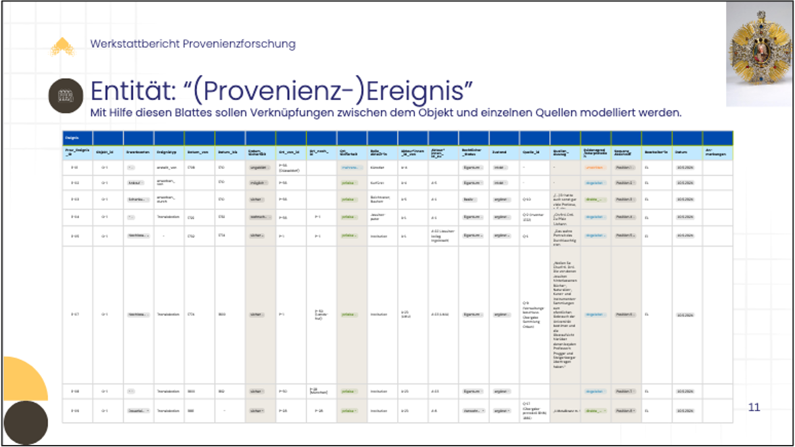 

> [!NOTE] 📝 Zur Vertiefung
> * Ludwig, E. (2026, Februar 18). Excel als Werkzeug der Provenienzforschung? Methodische Überlegungen zur Datenmodellierung frühneuzeitlicher Bestände in Universitätssammlungen. Zenodo. https://doi.org/10.5281/zenodo.18701204 

> [!TIP] 💡 Tipp 
> Diese Tabelle ist auf der Grundlage des „Leitfadens zur Standardisierung von Provenienzangaben“ (2018) entstanden. Sie kann als Anregung für die eigene strukturierte Erfassung von Provenienzangaben genutzt werden: 
> 
> https://docs.google.com/spreadsheets/d/14D1vQUDafm60izKozyULZW2wVIoEgHxBziyItVZ7mZo/edit?gid=0#gid=0 

> [!NOTE] 📝 Zur Vertiefung
> * Jannidis, F. (2017). Grundlagen der Datenmodellierung. In F. Jannidis, H. Kohle, & M. Rehbein (Hrsg.), Digital Humanities: Eine Einführung (S. 99–108). J.B. Metzler

---

### Themenbereich 3: Übungen
Auf dieser Seite können Sie anhhand einiger Fragen Ihr wissen überprüfen und durch einen Use Case das Gelernte vertiefen bzw. reflektieren.

Fragebogen
=========

                            {{1}}

Was sind Provenienzketten?

(Single-Choice)

    [[ ]] umfassende Dokumentation einer Objektrecherche
    [[X]] kurze, strukturierte Zusammenfassung der Herkunft eines Objektes
    [[ ]] vereinzelte Angaben zu einem Objekt
    [[ ]] zusammenfassender Fließtext der Objektrecherche

                            {{2}}
Welche Informationen werden in Provenienzketten dargestellt?

(Multiple-Choice)

    [[X]] Zeitangaben
    [[X]] Besitz bzw. Eigentumswechsel
    [[X]] Standortsangaben
    [[X]] Personendaten

                           {{3}}
Welche Qualitätskriterien sollten Provenienzangaben bzw. -ketten erfüllen?

(Multiple-Choice)

    [[X]] einheitliche Erfassungssyntax
    [[X]] auf- oder absteigende Chronologie
    [[X]] transparenter und nachvollziehbarer Einbezug von Quellen
    [[ ]] möglichst detailreicher Fließtext

                           {{4}}
Was sind die FAIR-Prinzipien? 

(Lückentext)

Die FAIR-Prinzipien sind eine Reihe von Leitlinien, die sicherstellen sollen, dass Daten unter klar definierten Bedingungen für die Wiederverwendung durch [[  Maschinen  ]] und Menschen geeignet sind. FAIR beschreibt, wie digitale Forschungsobjekte - insbesondere Daten und deren Metadaten - gestaltet sein sollten, damit sie [[  auffindbar  ]](F), zugänglich (A), [[  interoperabel  ]] (I) und wiederverwendbar (R) sind – und das auch, wenn der Zugriff auf die Daten aus rechtlichen, ethischen oder sicherheitsrelevanten Gründen eingeschränkt ist.

                            {{5}}
Zu welchem Metadaten-Typ können Provenienzangaben zu Objekten hauptsächlich gezählt werden?

(Single-Choice)

    [[ ]] administrative Metadaten 
    [[X]] deskriptive Metadaten
    [[ ]] strukturelle Metadaten
    [[ ]] technische Metadaten

Use Case
===

Nora arbeitet seit drei Wochen neu in einer Universitätssammlung. Ihre Vorgesetzte hat sie gebeten, Provenienzangaben zu fünf Objekten auf der institutseigenen Website zu veröffentlichen, um mehr Transparenz zu schaffen, auch im Sinne des fünften Grundsatzes der Washingtoner Prinzipien. Dieser besagt, dass sich die unterzeichnenden Staaten zur transparenten Publikation von Provenienzen von Kulturgütern verpflichten. Die Angaben sollen später möglichst auch in eine Datenbank übernommen werden. Es geht also um eine gut strukturierte und weiterverwendbare Objekterfassung. Nora öffnet einen Aktenordner und findet folgende historisch gewachsene Notizen:

* Notiz: „aus Privatbesitz; wohl Berlin; 1937 bei Möller; später Degwitz, Jena/Berlin; 1954 Sammlung Uni“
* Post-It: „Evtl. jüdische Vorbesitzer? 1933–1945 unklar.“
* Erwerbsbuch: „1954 übernommen aus Landesamt, vorher v. Degwitz.“

                            {{1}}
Welche Herausforderungen erkennen Sie bei Noras Provenienzangaben?

(Multiple-Choice)

- [[X]] Personen und Institutionen sind nicht eindeutig identifiziert. 
- [[ ]] Die Angaben sind abgesehen vom Zeitraum 1933-1945 vollständig und können direkt veröffentlicht werden.
- [[X]] Die zeitlichen Abfolgen sind teilweise unklar.
- [[x]] Besitz-, Eigentums und Standortwechsel sind nicht klar getrennt.

                            {{2}}
Warum sollte Nora die Provenienzen strukturiert erfassen?

(Reflexion: Nehmen Sie sich etwas Zeit, um über die Frage nachzudenken.)

Lösungshinweise

- hilft dabei, Daten aus verschiedenen Einrichtungen nachvollziehbar, überprüfbar und nachnutzbar zu machen
- erleichtert das Suchen, Filtern und Verglichen von Informationen
- Mehrarbeit kann vermieden werden
- Datengetriebene Forschung wie beispielsweise Datenanalysen oder Netzwerkanalysen ermöglichen

                            {{3}}
Was würden Sie Nora empfehlen?

(Reflexion: Nehmen Sie sich etwas Zeit, um über die Frage nachzudenken.)

Lösungshinweise

- Personenrecherche angefangen mit GND, Wikidata, etc., anschließend Archivbesuche
- Angaben strukturiert erfassen, dafür Metadatenschemas anschauen und gucken welches zu ihr passt
- ggf. eigenes erstellen (mithilfe des Leitfadens zur Standardisierung von Provenienzangaben)

---

## 4. Quellen und Literatur
*	AG Minimaldatensatz, Marchini, C., Ando, M., Bernhard, A.-M., Böhm, E., Diepenbrock, N., Frech, A., Götsch, S., Gerber, A., Gnyp, A., Greisinger, S., Grotrian, E., von Hagel, F., Kailus, A., Koch, A.-K., Krause, C., Kudlinski, V., Nowicki, A.-L., Purschwitz, A., … Wassermann, S. (2025). Minimaldatensatz-Empfehlung für Museen und Sammlungen (MDS v1.1). Zenodo. https://doi.org/10.5281/ZENODO.17275487
*	Ahrndt, W., & Deutscher Museumsbund e.V. (Hrsg.). (2021). Leitfaden zum Umgang mit Sammlungsgut aus kolonialen Kontexten (3. Aufl.). Deutscher Museumsbund e.V. https://www.museumsbund.de/publikationen/leitfaden-zum-umgang-mit-sammlungsgut-aus-kolonialen-kontexten/
*	Andratschke, C., Hartmann, J., Poltermann, J., Reuter, B., Schmeisser, I., & Schöddert, W. (2018). Leitfaden zur Standardisierung von Provenienzangaben. https://www.arbeitskreis-provenienzforschung.org/wp-content/uploads/2022/10/Leitfaden_APFeV_online.pdf
*	Arbeitsgruppe Ethik des Internationalen Komitees für Naturhistorische Museen und Sammlungen im Internationalen Museumsrat ICOM NATHIST (Hrsg.). (2013). ICOM Ethikkodex für Naturhistorische Museen. https://icomnathist.wordpress.com/wp-content/uploads/2019/02/nathist_code-of-ethics_dt_012019.pdf
*	Archivführer Kolonialzeit. (o. J.). Abgerufen 9. März 2026, von https://archivfuehrer-kolonialzeit.de/
*	Blübaum, D., Munzinger-Brandt, C., & Maaz, B. (Hrsg.). (2012). Museumsgut und Eigentumsfragen. Die Nachkriegszeit und ihre heutige Relevanz in der Rechtspraxis der Museen in den neuen Bundesländern. Mitteldeutscher Verlag.
*	Brandstetter, A.-M., & Hierholzer, V. (Hrsg.). (2017). Nicht nur Raubkunst!: Sensible Dinge in Museen und universitären Sammlungen (1. Aufl.). V&R unipress. https://doi.org/10.14220/9783737008082
*	Bundesarchiv. (o. J.). Quellen zum Deutschen Reich im Nationalsozialismus. Abgerufen 29. November 2024, von https://www.bundesarchiv.de/im-archiv-recherchieren/archivgut-recherchieren/nach-themen/quellen-zum-deutschen-reich-im-nationalsozialismus/
*	Bundesstiftung zur Aufarbeitung der SED-Diktatur. (o. J.). Biographische Datenbanken | Bundesstiftung zur Aufarbeitung der SED-Diktatur. Abgerufen 8. Januar 2025, von https://www.bundesstiftung-aufarbeitung.de/de/recherche/kataloge-datenbanken/biographische-datenbanken
*	Cohen, V. J.-M., Heimann-Jelinek, F., & Weinberger, R. J. (2019). Handbuch zur Judaica Provenienzforschung: Zeremonialobjekte (F. Heimann-Jelinek, Übers.). https://art.claimscon.org/wp-content/uploads/2019/09/Judaica-Handbook-DE_17-Sep-2019.pdf
*	Cornwall, J., Hildebrandt, S., Champney, T. H., Billings, B., Schmitt, B., & Winkelmann, A. (2024). IFAA recommendations for the ethical use of anatomical images. Anatomical Sciences Education, 17(1), 7–10. https://doi.org/10.1002/ase.2349
*	Dancuk, M. (2021, April 22). What Is a Graph Database? phoenixNAP. https://phoenixnap.de/kb/Diagrammdatenbank
*	Das Bundesarchiv. (o. J.). Quellen zur Kolonialgeschichte. Stasi-Unterlagen-Archiv. Abgerufen 8. Januar 2025, von https://www.bundesarchiv.de/im-archiv-recherchieren/archivgut-recherchieren/nach-themen/kolonialgeschichte/
*	Deppe, A. (2020). FAIR, CARE und mehr. Prinzipien für einen verantwortungsvollen Umgang mit Forschungsdaten. In M. Schulze (Hrsg.), Historisches Erbe und zeitgemäße Informationsinfrastrukturen: Bibliotheken am Anfang des 21. Jahrhunderts (S. 299–312). Kassel University Press.
*	Der Beauftragte der Bundesregierung für Kultur und Medien. (2025). Handreichung zur Umsetzung der „Erklärung der Bundesregierung, der Länder und der kommunalen Spitzenverbände zur Auffindung und zur Rückgabe NS-verfolgungsbedingt entzogenen Kulturgutes, insbesondere aus jüdi schem Besitz“ vom Dezember 1999. Neufassung 2025. https://kulturgutverluste.de/sites/default/files/2026-01/Handreichung.pdf
*	Deutsche Digitale Bibliothek. (o. J.). Ausgewähltes Vokabular: DDB Provenienz. Abgerufen 29. Januar 2025, von https://xtree-public.digicult-verbund.de/vocnet/?uriVocItem=http%3A%2F%2Fddb.vocnet.org%2Fprovenance/p0030&startNode=p0030&lang=de
*	Deutsche Digitale Bibliothek. (2015). Normdaten. In DDBpro Glossar. https://pro.deutsche-digitale-bibliothek.de/glossar/normdaten
*	Deutsche Digitale Bibliothek. (2022). Kontrolliertes Vokabular. In DDBpro Glossar. https://pro.deutsche-digitale-bibliothek.de/glossar/kontrolliertes-vokabular
*	Deutsche Digitale Bibliothek. (2023). Erschließungempfehlungen CCC-Datenkatalog [Datensatz]. https://docs.google.com/spreadsheets/d/1ADMtckHAATG5gjR8R2LfA785tVW_F4dNdP2DIxGazug/edit?gid=1624690635#gid=1624690635
*	Deutscher Museumsbund e.V. (Hrsg.). (2013, April). Empfehlungen zum Umgang mit menschlichen Überresten in Museen und Sammlungen. https://www.museumsbund.de/wp-content/uploads/2017/04/2013-empfehlungen-zum-umgang-mit-menschl-ueberresten.pdf
*	Deutsches Zentrum Kulturgutverluste. (o. J.-a). Koloniale Kontexte: Grundlagen & Übersicht. Abgerufen 9. März 2026, von https://kulturgutverluste.de/kontexte/koloniale-kontexte
*	Deutsches Zentrum Kulturgutverluste. (o. J.-b). NS-Raubgut: Grundlagen und Übersicht. Abgerufen 9. März 2026, von https://kulturgutverluste.de/kontexte/ns-raubgut
*	Deutsches Zentrum Kulturgutverluste. (o. J.-b). SBZ / DDR: Grundlagen & Übersicht. Abgerufen 9. März 2026, von https://kulturgutverluste.de/kontexte/sbz-ddr
*	Deutsches Zentrum Kulturgutverluste (Hrsg.). (1998, Dezember 3). Wahingtoner Prinzipien. https://kulturgutverluste.de/kontexte/ns-raubgut#prinzipien
*	Deutsches Zentrum Kulturgutverluste (Hrsg.). (1999, Juni 4). Gemeinsame Erklärung. https://kulturgutverluste.de/sites/default/files/2023-04/Gemeinsame-Erklaerung.pdf
*	Deutsches Zentrum Kulturgutverluste (Hrsg.). (2017, Februar 6). Grundlinien zur Erforschung der Kulturgutentziehungen in SBZ und DDR.
*	Deutsches Zentrum Kulturgutverluste (Hrsg.). (2023). Checkliste „Auftauchen von Beutekunst“. https://kulturgutverluste.de/sites/default/files/2023-04/Checkliste%20Kriegsverluste.pdf
*	Deutsches Zentrum Kulturgutverluste. (2024c, Juni 26). https://kulturgutverluste.de/
*	Deutsches Zentrum Kulturgutverluste, Arbeitskreis Provenienzforschung e.V, Deutscher Bibliotheksverband, Deutscher Museumsbund, & ICOM Deutschland (Hrsg.). (2019). Leitfaden Provenienzforschung: Zur Identifizierung von Kulturgut, das während der nationalsozialistischen Herrschaft verfolgungsbedingt entzogen wurde. Deutsches Zentrum Kulturgutverluste. https://www.proveana.de/de/media/29/download?attachment
* Deutsches Zentrum Kulturgutverluste, bildbad. (2023a). Erklärfilm „Was ist die Lost Art-Datenbank?“. https://youtu.be/IIw8ltLBXoA?si=W_LcvkScnzSRpQFp 
* Deutsches Zentrum Kulturgutverluste, bildbad. (2023b). Erklärfilm „Was ist Provenienzforschung?“. https://youtu.be/v7MfOh1T99E?si=o21cYhZWilk9HGBp 
* Deutsches Zentrum Kulturgutverluste, bildbad. (2023c). Erklärfilm „Was sind gerechte und faire Lösungen?“ https://youtu.be/9F2WYn2EpMo?si=o1yqDwGFaAzGZnIs 
* Deutsches Zentrum Kulturgutverluste, bildbad. (2024a). Erklärfilm „Der Kulturgutraub der Nationalsozialisten“. https://youtu.be/hf0Pp7u76kw?si=_UgQbm0ygTElq9sH 
* Deutsches Zentrum Kulturgutverluste, bildbad. (2024b). Erklärfilm „Der Kulturgutraub in der Sowjetischen Besatzungszone und der DDR“. https://youtu.be/iqHpGRXzbF8?si=D6a4hC-I9T87qMzb 
* Deutsches Zentrum Kulturgutverluste, bildbad. (2024b). Erklärfilm „Der Raub von Kultur- und Sammlungsgut im Kolonialismus“. (2024). https://youtu.be/cAEWE-ZZJbg?si=AyNu4eMWmVQf7PvR 
*	Deutschlands Zukunft gestalten. Koalitionsvertrag zwischen CDU, CSU und SPD 18. Legislaturperiode. (2023).
*	Ein neuer Aufbruch für Europa Eine neue Dynamik für Deutschland Ein neuer Zusammenhalt für unser Land. Koalitionsvertrag zwischen CDU, CSU und SPD 19. Legislaturperiode. (2018, März 12). https://archiv.cdu.de/system/tdf/media/dokumente/koalitionsvertrag_2018.pdf?file=1
*	Einführung in kontrollierte Vokabulare (A. Winkler, Narr.). (2022). [Videoaufnahme]. https://www.digis-berlin.de/digis-metadaten-electure/#acc-c6qu470-0
*	Erste Eckpunkte zum Umgang mit Sammlungsgut aus kolonialen Kontexten der Staatsministerin des Bundes für Kultur und Medien, der Staatsministerin im Auswärtigen Amt für internationale Kulturpolitik, der Kulturministerinnen und Kulturminister der Länder und der kommunalen Spitzenverbände. (2019, März 13). https://www.kmk.org/fileadmin/pdf/PresseUndAktuelles/2019/2019-03-25_Erste-Eckpunkte-Sammlungsgut-koloniale-Kontexte_final.pdf
* FAIR Principles. (o. J.). GO FAIR. Abgerufen 3. Juli 2026, von https://www.go-fair.org/fair-principles/
* FAIRe Daten. (o. J.). Abgerufen 3. Juli 2026, von https://forschungsdaten.info/fdm-allgemein/veroeffentlichen-und-archivieren/faire-daten
*	Finkenauer, T., & Thiessen, J. (2023). Kunstraub für den Sozialismus: Zur rechtlichen Beurteilung von Kulturgutentziehungen in SBZ und DDR (Deutsches Zentrum Kulturgutverluste, Hrsg.). De Gruyter. https://doi.org/10.1515/9783111279817
*	Fründt, S. (2015, August 9). S wie Sensible Sammlungen [Billet]. Museum und Verantwortung. https://sensmus.hypotheses.org/117
*	Gemeinsame Leitlinie zum Umgang zum Umgang mit Kulturgütern und menschlichen Überresten aus kolonialen Kontexten des Staatsministers des Bundes für Kultur und Medien der Staatsministerin im Auswärtigen Amt, der Kulturministerinnen und Kulturminister der Länder und der kommunalen Spitzenverbände. (o. J.).
*	Gesetz über die Entschädigung nach dem Gesetz zur Regelung offener Vermögensfragen und über staatliche Ausgleichsleistungen für Enteignungen auf besatzungsrechtlicher oder besatzungshoheitlicher Grundlage (Entschädigungs- und Ausgleichsleistungsgesetz—EALG). (1994, September 27). https://www.gesetze-im-internet.de/ealg/BJNR262400994.html
*	Gesetz zum Schutz von Kulturgut (Kulturgutschutzgesetz – KGSG). (2019, November 20). https://www.gesetze-im-internet.de/kgsg/KGSG.pdf
*	Grimme, G., Hüsgen, J., & Müller, L. (2024). Digital Resources for Researching Materials from Colonial Contexts in Libraries, Archives and Museums & University Collections. https://doi.org/10.18452/30911
*	Grundsätze der Washingtoner Konferenz in Bezug auf Kunstwerke, die von den Nationalsozialisten beschlagnahmt wurden (Washington Principles). (1998, Dezember 3). https://kulturgutverluste.de/kontexte/ns-raubgut
*	Heidt, S. (2017). Restitutionsbegehren bei NS-Raubkunst: Praxisleitfaden zur „Handreichung zur Umsetzung der ‚Erklärung der Bundesregierung, der Länder und der kommunalen Spitzenverbände zur Auffindung und zur Rückgabe NS-verfolgungsbedingt entzogenen Kulturgutes, insbesondere aus jüdischem Besitz‘“. Duncker & Humblot.
*	Herter, M. (2022). Was ist Data Science? In B. Wawrzyniak & M. Herter (Hrsg.), Neue Dimensionen in Data Science: Interdisziplinäre Ansätze und Anwendungen aus Wissenschaft und Wirtschaft (S. 17–34). Wichmann.
*	Hopp, M. (2022, Juli 6). Digitale Provenienzforschung. Methoden und Herausforderungen. Offenes Forschungskolloquium Digital History, Berlin. https://doi.org/10.58079/nl3t
*	ICOM Standing Committee on Ethics. (2026). ICOM Code of Ethics for Museums. https://icom-deutschland.de/wp-content/uploads/2026/06/Code-of-Ethics_2026_EN-1.pdf
*	International ICOM Committee for, University Museums and Collections, & International ICOM Committee for University Museums and Collections (Hrsg.). (2021, Dezember). UMAC Guidance for Restitution and Return of items from university museums and collections. http://umac.icom.museum/wp-content/uploads/2022/03/UMAC-Guidance-Restitution-2022.pdf
*	Jannidis, F. (2017). Grundlagen der Datenmodellierung. In F. Jannidis, H. Kohle, & M. Rehbein (Hrsg.), Digital Humanities: Eine Einführung (S. 99–108). J.B. Metzler.
*	JDCRP. (o. J.). Legacy Explorer. Abgerufen 9. März 2026, von https://explorer.rjlegacy.org/
*	JDCRP. (2025). Link-Liste zu "NS-Raubkunst: Wie kann ich das recherchieren? Eine Einführung als Online-Seminar in drei Schritten”. http://de.jdcrp.org/wp-content/uploads/Linkliste_Onlineseminar_JDCRP-ZI-TU_Modul.pdf
*	Jetter, M. (2004). Semantische und logische Datenmodellierung multidimensionaler Strukturen am Beispiel Microsoft® SQL ServerTM „Yukon“. https://hdms.bsz-bw.de/frontdoor/deliver/index/docId/491/file/michael(1).pdf
*	Johann, S., Müller-Spreitz, A., & Sachse, A. (2024). Erstcheck Provenienzforschung. Eine Handreichung für die Praxis (Museumsverband Sachsen-Anhalt e. V, Museumsverband des Landes Brandenburg e. V., & Museumsverband Hessen e. V., Hrsg.). https://www.museen-brandenburg.de/themen/provenienzforschung/handreichung-erstcheck-provenienzforschung
*	Kaiser, K., & Ina, H. (2022). Ein Leitfaden für den Umgang mit naturkundlichen Sammlungen aus kolonialen Kontexten. Natur im Museum, (12).
*	Kaiser, K., & Madruga, C. (2024). Tagging Objects from Colonial Contexts: A Decision Tree for Natural History Collections. Working Paper Deutsches Zentrum Kulturgutverluste, 7. https://doi.org/10.25360/01-2024-00005
*	Kommunikations-, Informations-, Medienzentrum (KIM) der Uni Konstanz. (2026). Metadaten. In Forschungsdaten.info: Praxis kompakt Glossar. https://forschungsdaten.info/praxis-kompakt/glossar/#c269911
*	Kontaktstelle für Sammlungsgut aus kolonialen Kontexten in Deutschland (Hrsg.). (2020, Oktober 14). Zugang – Transparenz – Kooperation. Leitlinien einer „3 Wege-Strategie“ für die Erfassung und digitale Veröffentlichung von Sammlungsgut aus kolonialen Kontexten in Deutschland. https://www.kmk.org/fileadmin/Dateien/pdf/PresseUndAktuelles/2020/201014_Kontaktstelle-Sammlungsgut_Konzept_3-Wege-Strategie.pdf
*	Kulturgut. (2026). In Wikipedia. https://de.wikipedia.org/w/index.php?title=Kulturgut&oldid=268425218
*	Kulturstiftung der Länder. (o. J.). Kontaktstelle für Sammlungsgut aus kolonialen Kontexten in Deutschland. Abgerufen 14. August 2024, von https://www.cp3c.de/
*	Kultusministerkonferenz (Hrsg.). (1999, Dezember 9). Erklärung der Bundesregierung, der Länder und der kommunalen Spitzenverbände zur Auffindung und zur Rückgabe NS-verfolgungsbedingt entzogenen Kulturgutes insbesondere aus jüdischem Besitz. https://kulturgutverluste.de/sites/default/files/2023-04/Gemeinsame-Erklaerung.pdf
*	Lang, S. (2023, August 7). Wie hat sich Provenienzforschung durch Digitalität verändert? RETOUR. https://doi.org/10.58079/tohp
*	Leyrer. K, Reichert, R. & Zöllner, G. (2025, Februar 5). Auf ein Soda mit der Fachexpertise Digitale Provenienzforschung. Dinge & Daten. https://sammlungen.io/blog/auf-ein-soda-mit-der-fachexpertise-digitale-provenienzforschung
*	Mähr, M., & Schnegg, N. (2024). Handbuch zur Erstellung diskriminierungsfreier Metadaten für historische Quellen und Forschungsdaten. https://doi.org/10.5281/zenodo.11124720
*	Mariani, F. (2022). Introducing VISU: Vagueness, Incompleteness, Subjectivity, and Uncertainty in Art Provenance Data. In Y. Rochat, C. Métrailler, & M. Piotrowski (Hrsg.), Proceedings of the Workshop on Computational Methods in the Humanities 2022, Lausanne, Switzerland, June 9-10, 2022 (Bd. 3602, S. 63–84). CEUR-WS.org. https://ceur-ws.org/Vol-3602/paper5.pdf
*	Maul, A. (o. J.). Vorschlag für ein gemeinsames Metadatenschema für die Sammlungen der Philipps-Universität Marburg [Datensatz]. Philipps-Universität Marburg, Stabsstelle Forschungsdatenmanagement. https://doi.org/10.17192/FDR/239
*	Maul, A. (2024). Sammlungsdigitalisierung an der Philipps-Universität Marburg 3—Metadaten für Sammlungen. Philipps-Universität Marburg. https://doi.org/10.17192/es2024.0935
*	Miedler, E. & Internationaler Museumsrat (Hrsg.). (2010). Ethische Richtlinien für Museen von ICOM (Überarb. 2. Aufl. der dt. Version). ICOM Schweiz - Internationaler Museumsrat. https://icom-deutschland.de/images/Publikationen_Buch/Publikation_5_Ethische_Richtlinien_dt_2010_komplett.pdf
*	Moeller, K., & Purschwitz, A. (2025). Kontrollierte Vokabulare und Normdaten der historisch arbeitenden Disziplinen. Historisches Datenzentrum Sachsen-Anhalt. https://doi.org/10.5281/zenodo.15745568
*	Oracle Corportation. (2021). Was ist eine relationale Datenbank? (RDBMS)? In Oracle. https://www.oracle.com/de/database/what-is-a-relational-database/
*	ProNto - Provenienzforschung-Navigator. (o. J.). Abgerufen https://tools.wissenschaftliche-sammlungen.de/pronto/
*	Quellen zu Kulturgutverlagerungen in SBZ und DDR. (o. J.). Stasi-Unterlagen-Archiv. Abgerufen 9. März 2026, von https://www.bundesarchiv.de/im-archiv-recherchieren/archivgut-recherchieren/nach-themen/quellen-zu-kulturgutentzug-kulturgutverlagerungen/1945-1990-kulturgutentzug-kulturgutverlagerungen-in-der-sowjetischen-besatzungszone-und-der-deutschen-demokratischen-republik/
*	Ridsdale, C., Rothwell, J., Smit, M., Bliemel, M., Irvine, D., Kelley, D., Matwin, S., Wuetherick, B., & Ali-Hassan, H. (2015). Strategies and Best Practices for Data Literacy Education Knowledge Synthesis Report. https://doi.org/10.13140/RG.2.1.1922.5044
*	Rother, L., Mariani, F., & Koss, M. (2023). Hidden Value: Provenance as a Source for Economic and Social History. Jahrbuch Für Wirtschaftsgeschichte / Economic History Yearbook, 64(1), 111–142. https://doi.org/10.1515/jbwg-2023-0005
*	Sarr, F., & Savoy, B. (2018, November 30). La restitution du patrimoine culturel africain, versune nouvelle éthique relationnelle | Ministère de la Culture. https://www.culture.gouv.fr/espace-documentation/rapports/La-restitution-du-patrimoine-culturel-africain-vers-une-nouvelle-ethique-relationnelle
*	SBZ / DDR: Grundlagen & Übersicht. (o. J.). Abgerufen 29. November 2024, von https://kulturgutverluste.de/kontexte/sbz-ddr
*	Scheunemann, J., & Sachse, A. (2024). Kulturgutentzug in der Sowjetischen Besatzungszone und der DDR: Historische Hintergründe, Praxisbeispiele und Rechercheansätze ; eine Handreichung für Museen (Museumsverband Sachsen-Anhalt & Museumsverband des Landes Brandenburg, Hrsg.). https://www.museen-brandenburg.de/themen/provenienzforschung/handreichung-kulturgutentzug-sbz-ddr
*	Schmid, T., & Wittemann, K. (2025, Juli 16). Inventarkarten zur Erschließung der Lehrmittelsammlung der Kunstgewerbeschule Pforzheim. Ein Pilotprojekt mit Scans, Python und museum-digital. https://doi.org/10.5281/zenodo.16269275
> * SPARQL.dev. (2026). The Comprehensive Guide to SPARQL in 2026. SPARQL.Dev. Abgerufen 19. August 2026, von https://sparql.dev/
*	Staatsministerin für Kultur und Medien, Leiter der Abteilung Kultur und Kommunikation im Auswärtigen Amt, Kulturministerinnen und -minister, Kultursenatorinnen und -senatoren der Länder sowie Vertreterinnen und Vertreter der kommunalen Spitzenverbände. (2020, Oktober 14). 3 Wege-Strategie für die Erfassung und digitale Veröffentlichung von Sammlungsgut aus kolonialen Kontexten in Deutschland. https://www.cp3c.de/3-Wege-Strategie/
*	Theiß, A., & Weber, C. (2019). Sensibles Sammlungsgut in Universitätssammlungen. Handreichung für einen Einstieg in die Provenienzforschung. Koordinierungsstelle für wissenschaftliche Universitätssammlungen in Deutschland. https://wissenschaftliche-sammlungen.de/de/service-material/materialien/handreichung-fuer-einen-einstieg-die-provenienzforschung
*	Türnich, R., Heckötter, A., & Offergeld, A. (mit LWL-Museumsamt für Westfalen). (2019). Projektbericht Provenienzforschung in NRW: Informationen und Empfehlungen für eine systematische, flächendeckende und nachhaltige Provenienzforschung (Landschaftsverband Rheinland, Hrsg.). Landschaftsverband Rheinland.
*	Universitäts- und Landesbibliothek Münster. (o. J.). Thesaurus. In LOTSE, Universitäts- und Landesbibliothek Münster. Abgerufen https://www.ulb.uni-muenster.de/lotse/literatursuche/suchstrategien/tipps/thesaurus.html
*	U.S. Department of State. (2024, März 5). Best Practices for the Washington Conference Principles on Nazi-Confiscated Art. United States Department of State. https://www.state.gov/office-of-the-special-envoy-for-holocaust-issues/best-practices-for-the-washington-conference-principles-on-nazi-confiscated-art/
*	Verantwortung für Deutschland Koalitionsvertrag zwischen CDU, CSU und SPD. 21. Legislaturperiode. (2025).
*	VermG. (o. J.). Abgerufen 9. März 2026, von https://www.gesetze-im-internet.de/vermg/
*	Winkelmann, A., Stoecker, H., Fründt, S., Förster, L., Reifenscheid, B., Krenn, M., Berner, M., Eggers, S., & Pawlowsky, V. (2022). Interdisziplinäre Provenienzforschung zu menschlichen Überresten aus kolonialen Kontexten: Eine methodische Arbeitshilfe des Deutschen Zentrums Kulturgutverluste, des Berliner Medizinhistorischen Museums der Charité und von ICOM Deutschland. In Arthistoricum.net-ART-Books. arthistoricum.net-ART-Books. https://doi.org/10.11588/arthistoricum.893
*	Yeide, N. H., Akinsha, Konstantin., & Walsh, A. L. (2001). The AAM Guide to Provenance Research (American Association of Museums., Hrsg.). American Association of Museums.
*	Zöllner, G. (2026). Provenienzangaben [Excel-Vorlage]. SODa. https://docs.google.com/spreadsheets/d/14D1vQUDafm60izKozyULZW2wVIoEgHxBziyItVZ7mZo/edit?gid=891049225#gid=891049225
*	Zuckerman, L. (Regisseur). (2022, Februar 3). Tracking Looted Art with Graphs: A Wikidata Case Study [Videoaufnahme]. https://www.academia.edu/video/l4aX5k?email_video_card=title&pls=FAAVP
*	Zuschlag, C. (2022). Einführung in die Provenienzforschung: Wie die Herkunft von Kulturgut entschlüsselt wird. C.H. Beck.

---

## Feedback und Informationen

Vielen Dank für das Interesse am [SODa](https://sammlungen.io/) Angebot. Damit wir die Ressourcen verbessern und anpassen können, freuen wir uns über jegliche Art von Feedback:

[**Feedback zum Selbstlernkurs "Einführung in die (Digitale) Provenienzforschung"**](https://lime.sammlungen.io/index.php/667777?lang=de&newtest=Y&oer=Einf_hrung_in_die__Digitale__Provenienzforschung)

---

Weitere SODa Selbstlernkurse sind auf unserer [**Knowlegbase**](https://sammlungen.io/kb/kb-suche?combine=&format%5B64%5D=64) zu finden.

Informationen und alle Module zu unserem SODa Basiskurs gibt es auf der [**SODa Basiskurs Seite**](https://sammlungen.io/kb/fdm/soda-basiskurs)**.**

---

**Weitere Fragen?**

Der **SODa Helpdesk** hilft bei allen Fragen rund um die Arbeit mit Daten an (Universitäts-)Sammlungen, zu Selbtlernkursen oder Workshops und bietet einen direkten Kontakt zum SODa Team in allen Belangen rund um Sammlungsdigitalisierung und Objektdaten an.

[**soda@sammlungen.io**](mailto:soda@sammlungen.io)

Wir freuen uns auf Ihre Anfrage!

---

## Impressum

SODa – Sammlungen, Objekte, Datenkompetenzen: https://sammlungen.io/
-----------------

---

**Autorinnen:**

- Gabriele Zöllner (gabriele.zoellner@hu-berlin.de)
- Rebekka Reichert (rebekka.reichert@hu-berlin.de)

---

**Zitiervorschlag:**

Zöllner, G. & Reichert, R. (2026). Einführung (Digitale) Provenienzforschung. Zenodo.

---

**Lizenz:**

")

---

Version: 1.0

Datum: 2026-09-03

Repository: https://github.com/soda-collections-objects-data-literacy/Einf-hrung-in-die-Digitale-Provenienzforschung

---

gefördert durch:

---